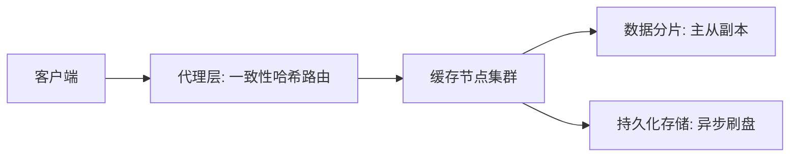
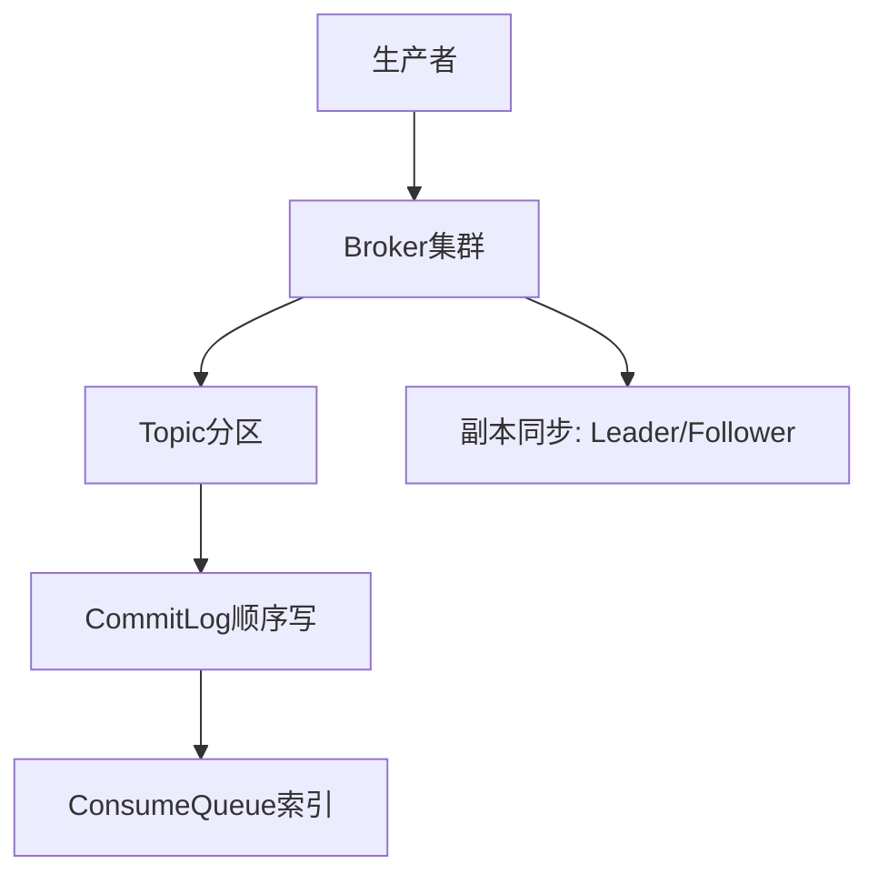

---

设计一个分布式缓存系统或消息队列系统需要围绕**高可用、高性能、可扩展性、数据一致性**四大核心目标展开。以下是两种系统的设计要点与实现方案：

---

### **一、分布式缓存系统设计**
#### **1. 核心目标**
- **低延迟**：90%请求在1ms内响应。
- **高可用**：99.99%可用性，容忍节点故障。
- **数据一致性**：最终一致性为主，部分场景强一致性。

#### **2. 架构设计**

##### **分层架构**
1. **客户端SDK**
    - 集成一致性哈希算法，本地缓存热点数据（如Guava Cache），减少网络调用。
    - 支持透明重试、故障节点自动剔除。

2. **代理层（可选）**
    - 无状态代理（如Twemproxy）负责请求路由，降低客户端复杂度。
    - 支持读写分离，将冷数据查询路由到从节点。

3. **存储层**
    - **数据分片**：采用虚拟槽（如Redis Cluster的16384 slots）实现动态扩缩容。
    - **副本机制**：主从异步复制（AP模型）或Raft/Paxos强一致性（CP模型）。
    - **持久化**：AOF日志异步刷盘，结合快照（RDB）快速恢复。

#### **3. 关键技术**
1. **一致性哈希**
    - 虚拟节点（200~500个/物理节点）解决数据倾斜问题。
    - 扩容时仅需迁移约1/N数据（N为原节点数）。

2. **缓存淘汰策略**
    - **分层淘汰**：LRU（内存）+ LFU（本地SSD缓存）+ TTL（过期数据）。
    - **热点保护**：滑动窗口计数识别热Key，单独存储并增加副本。

3. **高可用机制**
    - **故障转移**：哨兵（Sentinel）监控主节点，30秒内完成切换。
    - **数据恢复**：通过Gossip协议同步节点状态，增量同步优先。

4. **一致性保障**
    - **缓存双写**：通过Write-through模式同步更新数据库与缓存。
    - **延迟双删**：数据库更新后异步删除缓存，解决并发写脏数据。

#### **4. 性能优化**
- **零拷贝网络**：使用Netty堆外内存减少数据拷贝。
- **批处理合并**：多个Set操作合并为Pipeline请求，降低网络开销。
- **冷热分离**：SSD存储大Value数据（如图片缓存），内存存小Key。

---

### **二、分布式消息队列系统设计**
#### **1. 核心目标**
- **高吞吐**：单集群百万TPS。
- **持久化**：消息不丢失，支持至少3副本。
- **顺序性**：分区内消息严格有序。

#### **2. 架构设计**

##### **核心组件**
1. **Broker集群**
    - **分区（Partition）**：每个Topic划分为多个分区，支持水平扩展。
    - **CommitLog**：所有消息顺序写入磁盘（类似Kafka的Segment），写入性能提升10倍+。
    - **索引文件**：构建ConsumeQueue（逻辑队列）实现随机读加速。

2. **NameServer**
    - 轻量级元数据管理（如Kafka的ZooKeeper），维护Topic- Broker映射关系。
    - 客户端定期拉取路由表，降低中心节点压力。

3. **生产者/消费者**
    - **生产者**：支持同步/异步发送，内存队列合并小消息。
    - **消费者**：Pull模式按批次拉取，Offset由客户端管理。

#### **3. 关键技术**
1. **消息持久化**
    - **页缓存加速**：利用Linux Page Cache，顺序写磁盘可达600MB/s。
    - **零拷贝传输**：通过`sendfile`系统调用减少内核态拷贝。

2. **高可用保障**
    - **ISR机制**：In-Sync Replicas集合动态维护可用副本（如Kafka）。
    - **故障切换**：Controller节点监控Broker状态，30秒内完成Leader切换。

3. **消息可靠性**
    - **生产者确认**：等待所有副本ACK（acks=all）才返回成功。
    - **消费者Commit**：至少一次语义通过手动提交Offset保证。

4. **顺序性保证**
    - **分区内顺序**：同一Key的消息哈希到同一分区。
    - **全局顺序**：单分区设计（牺牲扩展性）。

#### **4. 性能优化**
- **批量压缩**：Snappy/LZ4压缩消息体，节省50%带宽。
- **异步刷盘**：累积200ms或64KB数据后批量写入磁盘。
- **读写分离**：Follower副本处理读请求，分担Leader压力。

---

### **三、两类系统设计对比**
| **维度**         | **分布式缓存**                | **分布式消息队列**              |
|------------------|-----------------------------|------------------------------|
| 数据生命周期      | 短期存储（分钟~天级）         | 中长期存储（小时~月级）        |
| 读写模式          | 随机读写为主                 | 顺序追加写+顺序读             |
| 一致性模型        | 最终一致性（主流）           | 分区顺序性+副本强一致性       |
| 扩展性瓶颈        | 数据倾斜与热点Key            | 分区数限制与磁盘IO            |
| 典型技术栈        | Redis Cluster/Memcached     | Kafka/RocketMQ/Pulsar        |

---

### **四、工业级优化案例**
1. **Redis Cluster生产实践**
    - 某电商平台通过Hash Tag将关联Key绑定到同一节点，解决事务问题。
    - 使用Proxy（如Codis）隐藏集群细节，客户端无感知扩容。

2. **Kafka万亿级消息优化**
    - 京东采用分层存储（Hot-Warm架构），7天热数据存SSD，历史数据转存OSS。
    - 通过Broker机架感知（Rack Awareness），跨机房流量减少60%。

---

### **五、设计验证指标**
1. **缓存系统**
    - 命中率 > 95%（反映缓存有效性）
    - P99延迟 < 5ms（衡量性能）
2. **消息队列**
    - 端到端延迟 < 100ms（生产到消费）
    - 消息堆积量 < 1小时（监控消费滞后）

---

### **总结**
设计分布式缓存需重点解决**数据分片、热点访问、快速故障恢复**；消息队列需聚焦**高吞吐持久化、顺序性保障、堆积处理**。二者均需通过**分层架构、副本机制、批量处理**实现高性能，并依赖**智能监控（如Prometheus）**与**自动化运维（K8s Operator）**保障稳定性。实际设计中可参考Redis/Kafka源码实现，结合业务场景（如电商秒杀、物流跟踪）进行剪裁优化。