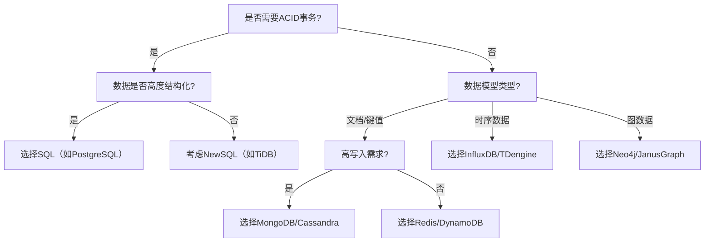

评估和选择数据库（SQL vs NoSQL）需要结合**业务场景、数据特性、扩展需求及团队能力**进行多维分析。以下是系统性评估框架与决策路径：

---

### **一、核心评估维度**
#### **1. 数据模型与查询模式**
| **维度**         | **SQL（关系型）**                          | **NoSQL**                              |
|------------------|------------------------------------------|----------------------------------------|
| **数据结构**      | 严格结构化（表结构，Schema约束）           | 灵活（文档、键值、列族、图等）           |
| **查询复杂度**    | 支持多表JOIN、复杂聚合（OLAP）             | 简单查询为主，部分支持二级索引（如MongoDB） |
| **事务支持**      | ACID强一致性（如银行转账）                 | 最终一致性为主，部分支持分布式事务（如Cassandra LWT） |

**决策建议**：
- 需要复杂事务（如订单支付） → **SQL**
- 数据结构多变（如用户行为日志）→ **NoSQL（文档型）**

---

#### **2. 扩展性与性能需求**
| **维度**         | **SQL**                                | **NoSQL**                              |
|------------------|----------------------------------------|----------------------------------------|
| **水平扩展**      | 有限（分库分表复杂）                    | 原生支持（如Cassandra自动分片）         |
| **写入吞吐**      | 受限于单机（如MySQL约5万TPS）           | 分布式写入（如HBase百万级TPS）          |
| **延迟敏感度**    | OLTP场景P99延迟要求高（<10ms）          | 可容忍更高延迟（如时序数据库）           |

**决策建议**：
- 高并发写入（如IoT设备数据） → **NoSQL（列存储或时序数据库）**
- 低延迟OLTP（如交易核心） → **SQL（优化索引+读写分离）**

---

#### **3. 一致性要求**
| **模型**         | **适用场景**                            | **代表数据库**                         |
|------------------|----------------------------------------|----------------------------------------|
| **强一致性**      | 金融交易、库存扣减                      | PostgreSQL、TiDB                      |
| **最终一致性**    | 社交动态、评论系统                      | Cassandra、DynamoDB                   |
| **因果一致性**    | 聊天消息、协同编辑                      | MongoDB、Couchbase                    |

**决策建议**：
- 强一致性 → **NewSQL（如TiDB）或SQL+分布式锁**
- 最终一致性 → **AP型NoSQL（如Cassandra）**

---

### **二、典型业务场景选型示例**
#### **1. 电商平台**
- **订单系统**
    - **SQL（MySQL Cluster）**：强事务保障（支付+库存扣减）。
    - **优化**：分库分表（按用户ID哈希）+ 本地SSD提升IOPS。
- **商品推荐**
    - **NoSQL（Redis Graph）**：实时分析用户-商品关系图。

#### **2. 物联网（IoT）**
- **设备数据存储**
    - **时序数据库（InfluxDB/TDengine）**：高效存储时间序列数据，支持降采样查询。
- **元数据管理**
    - **文档数据库（MongoDB）**：灵活存储设备动态属性（如传感器配置）。

#### **3. 社交网络**
- **用户动态Feed流**
    - **列存储（Cassandra）**：高吞吐写入，支持多地数据中心同步。
- **好友关系**
    - **图数据库（Neo4j）**：高效遍历多度关系（如“朋友的朋友”）。

---

### **三、选型决策树**

---

### **四、混合架构实践**
#### **1. 多模数据库（Multi-Model）**
- **适用场景**：需要同时支持多种数据模型（如文档+图）。
- **代表方案**：
    - **ArangoDB**：统一处理文档、图和键值数据。
    - **Azure Cosmos DB**：多API支持（SQL、MongoDB、Cassandra等）。

#### **2. 读写分离与缓存层**
- **SQL为主 + NoSQL为辅**：
    - **写路径**：MySQL处理事务 → Binlog同步至Elasticsearch提供搜索。
    - **读路径**：Redis缓存热点数据，减轻数据库压力。

---

### **五、评估工具与验证指标**
1. **性能压测工具**：
    - **SQL**：SysBench、TPC-C
    - **NoSQL**：YCSB（Yahoo! Cloud Serving Benchmark）
2. **关键指标**：
    - **吞吐量**：TPS（每秒事务数）
    - **延迟**：P95/P99响应时间
    - **可用性**：全年停机时间（如99.99%即全年最多53分钟）

---

### **六、团队与运维考量**
1. **技术栈匹配**：
    - Java团队 → 优先考虑JDBC兼容的数据库（如MySQL）。
    - Python/Node.js团队 → 可倾向MongoDB等文档数据库。
2. **运维复杂度**：
    - **云托管服务**：AWS RDS、MongoDB Atlas降低运维负担。
    - **自建集群**：需投入专家资源（如HBase运维需熟悉HDFS）。

---

### **总结**
数据库选型的核心逻辑：
1. **明确业务需求**：事务、扩展性、数据模型。
2. **量化性能指标**：通过压测验证TPS、延迟。
3. **平衡技术债务**：避免过度追求新技术，优先成熟方案。

**最终建议**：
- **传统企业系统**：PostgreSQL/Oracle（强事务+复杂查询）。
- **互联网高并发场景**：TiDB（NewSQL）+ Redis（缓存）+ Kafka（异步处理）。
- **大数据分析平台**：ClickHouse（OLAP）+ HBase（海量存储）。