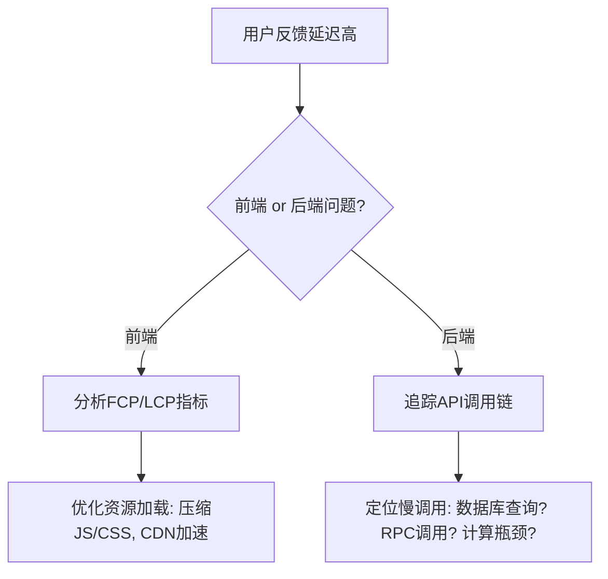

---

解决系统高延迟问题需要从**全链路诊断、分层优化、架构调整**三个维度系统性推进。以下是分步骤的优化方案：

---

### **一、全链路诊断与根因定位**
#### **1. 建立观测基线**
- **指标定义**：
    - **用户侧**：首屏时间（FMP）、API P99延迟、页面完全加载时间（FCP）。
    - **服务侧**：服务调用链耗时（Trace）、数据库查询时间（Query Duration）、GC暂停时间。
- **工具链**：
    - **APM**：SkyWalking、Datadog追踪跨服务调用。
    - **日志分析**：ELK（Elasticsearch+Logstash+Kibana）聚合异常日志。
    - **基础设施监控**：Prometheus+Grafana监控CPU、内存、网络IO。

#### **2. 根因分析路径**

---

### **二、分层优化策略**
#### **1. 网络层优化**
- **降低传输延迟**：
    - **协议优化**：HTTP/2多路复用替代HTTP/1.1，QUIC协议（HTTP/3）应对弱网环境。
    - **智能路由**：使用云厂商全球加速服务（如AWS Global Accelerator），动态选择最优路径。
- **CDN静态资源加速**：
    - 非动态内容（图片、视频）预热至边缘节点，减少回源请求。

#### **2. 应用层优化**
- **代码级调优**：
    - **算法优化**：将O(n²)暴力搜索替换为哈希表（O(1)）或二分查找（O(log n)）。
    - **减少序列化开销**：Protobuf替代JSON，减少50%序列化时间。
    - **锁粒度控制**：将全局锁拆分为分段锁（如ConcurrentHashMap设计）。
- **异步化改造**：
    - **非阻塞IO**：Netty替代Tomcat BIO线程模型，提升吞吐量。
    - **削峰填谷**：Kafka承接突发流量，异步处理日志、通知等非核心逻辑。

#### **3. 数据层优化**
- **数据库调优**：
    - **索引下推**：MySQL 5.6+利用ICP减少回表次数。
    - **批处理写入**：使用`INSERT ... ON DUPLICATE KEY UPDATE`合并写操作。
- **缓存策略升级**：
    - **本地缓存**：Caffeine缓存频繁访问的元数据（如用户基础信息）。
    - **分布式缓存**：Redis Cluster缓存热点商品详情，采用Hash Tag保证事务性。

---

### **三、架构级深度优化**
#### **1. 服务拆分与治理**
- **微服务粒度细化**：
    - 将单体服务拆分为订单服务、库存服务、支付服务，减少跨模块耦合。
    - **服务合并**：高频调用的关联服务（如用户+权限）合并部署，减少网络开销。
- **服务网格化**：
    - 通过Istio实现流量镜像、重试策略、熔断机制，降低跨服务调用延迟。

#### **2. 数据架构升级**
- **读写分离**：
    - 写操作走MySQL主库，读操作分发至从库+Redis缓存。
- **实时OLAP**：
    - 将复杂报表查询迁移至ClickHouse，减少对OLTP数据库的扫描压力。

#### **3. 资源隔离与弹性扩展**
- **容器化部署**：
    - Kubernetes HPA（Horizontal Pod Autoscaler）根据CPU/内存自动扩缩容。
    - **资源配额**：为关键服务（如支付）分配独占节点，避免资源争抢。
- **Serverless化**：
    - 突发流量场景使用AWS Lambda处理边缘计算任务（如图片压缩）。

---

### **四、实战优化案例**
#### **案例：电商下单接口延迟从2s降至200ms**
1. **问题定位**：
    - SkyWalking追踪显示70%时间消耗在库存服务远程调用与数据库锁竞争。
2. **优化步骤**：
    - **库存预扣优化**：Redis Lua脚本实现原子化扣减，避免数据库行锁。
    - **本地缓存加速**：库存服务本地缓存可售库存，每隔100ms同步数据库。
    - **RPC协议升级**：gRPC替代HTTP，序列化时间减少40%。
3. **结果**：
    - 接口P99延迟从2s降至200ms，TPS提升5倍。

---

### **五、长效治理机制**
1. **容量规划**：
    - 定期压力测试（如JMeter模拟双十一流量），提前扩容关键组件。
2. **混沌工程**：
    - 注入网络延迟、节点故障，验证系统容错能力（如Netflix Chaos Monkey）。
3. **代码规范**：
    - 静态代码分析（SonarQube）禁止全表扫描、强制索引使用。

---

### **总结**
解决高延迟需遵循**“观测→拆解→优化→验证”**闭环：
1. **精准定位瓶颈**：通过全链路追踪锁定耗时最长环节。
2. **分层击破**：网络、应用、数据层针对性优化。
3. **架构解耦**：微服务拆分、缓存、异步化降低系统性耦合。
4. **自动化防控**：弹性伸缩、混沌测试保障长期稳定。

最终目标：在成本可控范围内，实现**用户体验**与**系统效率**的最佳平衡。