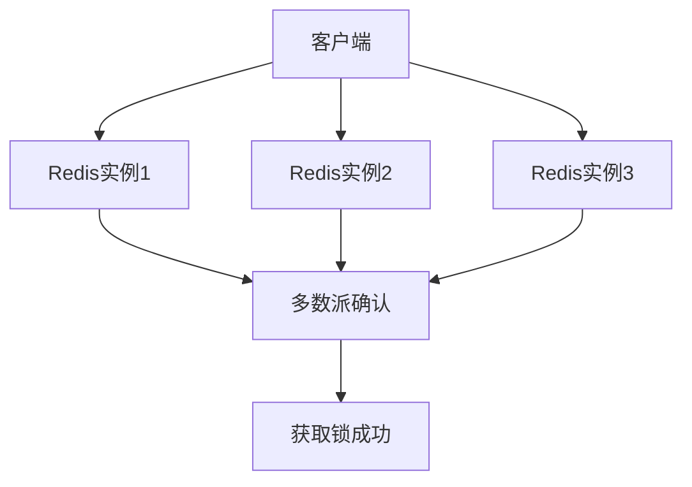
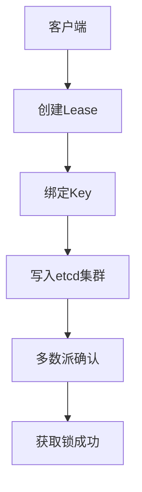

---

设计高可用分布式锁需满足**互斥性、容错性、避免死锁、高性能**四大核心目标。以下从技术选型、架构设计、容错机制及工业级实践四个维度详细阐述：

---

### **一、技术选型与对比**
| **方案**               | **核心原理**                              | **优点**                          | **缺点**                          | **适用场景**             |
|------------------------|-----------------------------------------|----------------------------------|----------------------------------|------------------------|
| **Redis RedLock**       | 多节点异步通信，基于NTP时钟同步              | 高性能，易于扩展                   | 时钟漂移可能导致锁失效              | 高吞吐，允许短暂不一致    |
| **ZooKeeper**          | 临时顺序节点+Watcher机制                  | 强一致性（CP），无时钟依赖          | 性能较低，写操作需集群多数派确认       | 强一致性要求场景         |
| **etcd**               | Raft共识算法，Lease租约机制               | 高可用，支持自动续期                | 需要维护长连接                     | Kubernetes等云原生环境  |
| **数据库悲观锁**        | 基于行锁（SELECT ... FOR UPDATE）          | 实现简单，无额外依赖                | 性能差，数据库压力大                | 低并发，已有数据库架构    |

---

### **二、高可用架构设计**
#### **1. Redis RedLock方案**

- **部署要求**：至少5个独立节点（避免脑裂），部署在不同物理机或可用区。
- **关键步骤**：
    1. 客户端向所有节点发送`SET lock_key uuid NX PX 30000`命令。
    2. 当半数以上节点（≥3）返回成功，且总耗时小于锁超时时间，则认为获取成功。
    3. 释放锁时需向所有节点发送Lua脚本删除对应key。

- **容错优化**：
    - **时钟同步**：使用NTP服务，最大时钟偏差控制在锁超时时间的1/10内。
    - **锁续期**：后台线程周期性（如超时时间的1/3）执行`EXPIRE`命令延长锁持有时间。

#### **2. etcd方案**

- **核心机制**：
    - **Lease租约**：客户端创建租约（如30秒），并定期刷新（KeepAlive）。
    - **Prefix Key**：写入键值对`/lock/resource_1/{lease_id}`，利用事务保证原子性。
- **优势**：
    - 通过Watch机制自动释放锁（租约到期），避免死锁。
    - Raft协议保障强一致性，适合关键业务（如支付系统）。

---

### **三、容错机制设计**
#### **1. 锁自动释放**
- **超时机制**：设置合理的锁超时时间（如10-30秒），确保客户端崩溃后锁自动释放。
  ```java
  // etcd Java客户端示例
  Lease leaseClient = client.getLeaseClient();
  long leaseId = leaseClient.grant(30).get().getID();
  // 绑定Key时设置租约
  client.putKVClient().put(ByteSequence.from("lock_key"), ByteSequence.from("value"),
      PutOption.newBuilder().withLeaseId(leaseId).build());
  ```

#### **2. 锁续期（Refresh）**
- **后台线程续期**：异步续约防止业务未完成时锁过期。
  ```python
  # Redis RedLock续期伪代码
  def refresh_lock(lock, ttl):
      while lock.is_held():
          for node in lock.nodes:
              node.expire(lock.key, ttl)
          time.sleep(ttl / 3)
  ```

#### **3. 防误删锁**
- **Token校验**：释放锁时验证客户端唯一标识（如UUID），避免误删其他客户端锁。
  ```lua
  -- Redis Lua脚本验证并删除锁
  if redis.call("get", KEYS[1]) == ARGV[1] then
      return redis.call("del", KEYS[1])
  else
      return 0
  end
  ```

#### **4. 故障转移（Failover）**
- **Leader选举**：ZooKeeper/etcd集群自动选举新Leader，客户端重连至健康节点。
- **客户端重试**：采用指数退避策略（如首次100ms，最大重试3次）。

---

### **四、工业级实践案例**
#### **案例：京东库存服务分布式锁优化**
- **初始问题**：Redis单节点锁在宕机时导致库存超卖。
- **优化方案**：
    1. **RedLock升级**：部署5节点Redis Cluster，跨机房容灾。
    2. **令牌桶限流**：限制每秒锁请求量，防止雪崩。
    3. **熔断降级**：Sentinel监控锁获取失败率，超过阈值时降级至本地库存校验。
- **成果**：锁服务可用性达99.99%，大促期间零超卖事故。

---

### **五、关键指标验证**
1. **性能指标**：
    - **获取锁延迟**：P99 < 50ms（etcd/Redis）。
    - **吞吐量**：单锁服务支持10,000+ TPS。
2. **可靠性指标**：
    - **MTBF（平均故障间隔）**：> 30天。
    - **锁冲突处理准确率**：100%。

---

### **总结**
设计高可用分布式锁需根据业务场景权衡**一致性、性能、复杂度**：
- **CP场景**：选用etcd/ZooKeeper，牺牲部分性能换取强一致性。
- **AP场景**：Redis RedLock优先可用性，需容忍极低概率锁失效。

**实施要点**：
1. **多节点冗余**：跨可用区部署，避免单点故障。
2. **租约与续期**：防止死锁与脑裂问题。
3. **客户端容错**：重试、熔断、降级多级防护。

参考AWS DynamoDB Lock Client与阿里云分布式锁服务（DLock）实现，结合业务需求定制化开发。