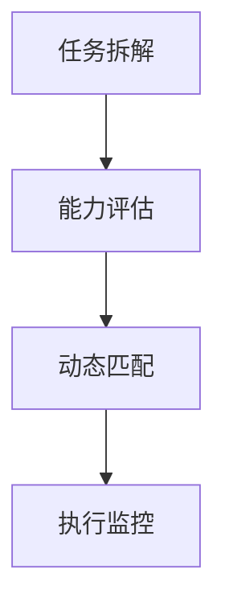
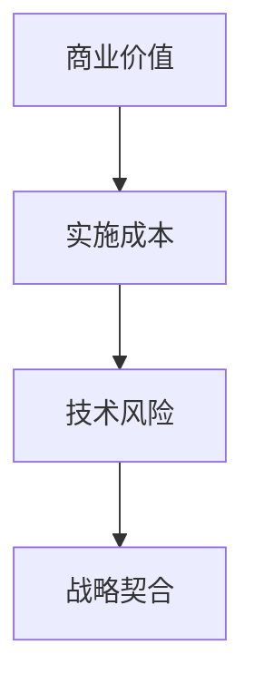

在复杂多变的研发环境中，高效的任务分配与优先级设定是保障团队产出的关键。以下是经过验证的实战框架，结合京东工业等中大型企业的最佳实践：

---

### **一、任务分配黄金三角模型**


#### **1. 任务拆解：WBS工作分解术**
- **业务目标→Epic→Feature→Task四级拆解**
  ```markdown
  目标：提升供应链预测准确率至95%（Q3）
  ↓
  Epic：构建预测模型V2.0
  ↓
  Feature：历史数据清洗模块
  ↓
  Task：开发异常数据过滤算法（Python实现）
  ```
- **SMART原则验证**：每个Task需符合具体、可衡量、可达成、相关性、时限性。

#### **2. 能力评估：建立三维人才地图**
- **技能维度**（示例）：
  ```markdown
  | 成员   | 算法 | Python | 大数据 | 沟通 |
  |--------|------|--------|--------|------|
  | 张三   | ★★★★ | ★★★☆   | ★★☆☆   | ★★★☆ |
  | 李四   | ★★☆☆ | ★★★★   | ★★★★   | ★★☆☆ |
  ```
- **心智模型**：通过霍兰德职业测试识别成员特性（现实型/研究型/艺术型）。

#### **3. 动态匹配：RACI矩阵实战**
| 任务                | 负责人（R） | 审批人（A） | 协作者（C） | 知会人（I） |
|---------------------|------------|------------|------------|------------|
| 数据清洗算法开发     | 张三       | 王架构师    | 李四       | 项目经理   |
| 模型性能压测        | 李四       | CTO        | 运维团队    | 产品经理   |

---

### **二、优先级设定：四维决策罗盘**


#### **1. ICE评分模型（Impact/Confidence/Ease）**
```markdown
| 任务                | 影响值(1-10) | 信心指数(0.1-1) | 难易度(1-10) | ICE总分 |
|---------------------|-------------|----------------|------------|---------|
| 库存服务重构        | 9           | 0.8            | 7          | 9*0.8/7=1.03 |
| 支付接口优化        | 6           | 0.9            | 3          | 6*0.9/3=1.8  |
```
**结论**：优先处理支付接口优化（ICE分更高）

#### **2. 技术债务量化评估**
- **公式**：`债务成本 = 维护耗时 × 团队时薪 × 风险系数`
  ```markdown
  | 债务项       | 月维护耗时 | 风险系数 | 年成本（万元） |
  |--------------|------------|----------|----------------|
  | 单体数据库   | 40h        | 1.5      | 40h*1.5*12*500元/h=36万 |
  | 老旧日志系统 | 20h        | 1.2      | 14.4万         |
  ```
**策略**：优先清偿高成本债务

---

### **三、敏捷优先级管理工具链**
#### **1. 双周迭代看板设计**
```markdown
| 泳道        | 进行中（WIP≤3） | 待测试          | 已完成          |
|-------------|----------------|----------------|----------------|
| 核心功能     | 订单拆单逻辑   | 库存同步接口    | 支付状态查询    |
| 技术债      | 数据库连接池优化| -               | 日志组件升级    |
```

#### **2. 自动化优先级计算**
- **Jira插件**：使用Advanced Roadmaps根据预设规则自动排序任务。
- **代码化规则**：GitLab Issue通过Label权重计算优先级。
  ```yaml
  # .gitlab/issue_rules.yml
  priority:
    - label: 'P0'
      weight: 100
      conditions: 
        - title_contains: '[安全漏洞]'
    - label: 'P1'
      weight: 80  
      conditions:
        - due_date <= 3d
  ```

---

### **四、突发事件应对策略**
#### **1. 四象限熔断机制**
```markdown
| 紧急度\重要度 | 高                  | 低                 |
|---------------|---------------------|--------------------|
| **高**        | 立刻处理（线上故障） | 快速响应（客户投诉）|
| **低**        | 计划执行（架构升级） | 暂缓处理（UI优化） |
```

#### **2. 资源动态调配**
- **红蓝军对抗模式**：预留10%人力组成"快速反应部队"处理突发需求。
- **云资源弹性**：通过阿里云ECS弹性伸缩组应对临时算力需求。

---

### **五、京东工业实战案例**
#### **案例：大促期间资源争夺战**
- **背景**：双11前2周，突发需支持政府级客户定制需求。
- **应对策略**：
    1. **优先级重置**：使用WSJF（加权最短作业优先）模型计算：
       ```
       WSJF = 业务价值 / 交付时长
       定制需求WSJF = 9/2 = 4.5  
       原计划任务WSJF = 7/3 = 2.3
       ```
    2. **资源调度**：从技术债小组临时抽调2名全栈工程师。
    3. **流程简化**：开启绿色通道，代码Review由3轮压缩至1轮。
- **成果**：3天交付定制模块，客户追加年度订单2000万。

---

### **六、长效治理机制**
1. **优先级透明化**：通过Confluence公示排序逻辑，减少团队争议。
2. **价值流分析**：每月用Value Stream Mapping识别20%高价值任务。
3. **动态校准会议**：每周五举行30分钟"优先级校准站会"（PrioSync Meeting）。

---

### **总结**
高效的任务分配=**科学的拆解能力 × 精准的人员匹配 × 透明的协作机制**  
智能的优先级设定=**数据驱动的决策 × 弹性应对变化 × 技术债务量化管理**

**实施口诀**：
- 复杂任务原子化，人才能力标签化
- 商业价值可计算，技术风险早评估
- 突发需求熔断制，资源预留保弹性
- 工具链上提效率，透明机制降摩擦

通过将NASA的任务优先级算法（CTMC）与亚马逊的逆向工作法结合，可构建出适应工业数字化场景的智能决策体系。