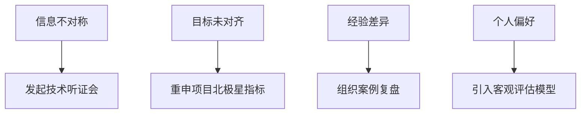

---

处理团队中的技术分歧需要**平衡技术创新与团队协作**，通过结构化流程将分歧转化为技术演进动力。以下是分步骤的解决方案，结合工业等大型团队实战经验：

---

### **一、分歧分类与根因分析**
#### **1. 分歧类型识别**
| **类型**         | **特征**                               | **典型案例**                      |
|------------------|---------------------------------------|----------------------------------|
| **技术路线争议**  | 架构选型、工具链差异（如Kafka vs RocketMQ） | 分布式消息中间件选型               |
| **实现方案分歧**  | 代码实现策略不同（同步vs异步处理）           | 订单支付状态同步机制设计           |
| **资源分配冲突**  | 人力/算力优先级争夺                       | AI训练资源分配：模型A vs 模型B     |

#### **2. 根因诊断四象限**


---

### **二、五步争议解决流程**
#### **Step 1：争议透明化**
- **工具支持**：使用Confluence创建「技术决策日志」，强制记录所有分歧点与各方论据。
- **示例模板**：
  ```markdown
  ## [决策主题] 订单ID生成方案选择  
  **提案A**：Snowflake算法（张三提出）  
  - 优点：分布式无冲突，性能高  
  - 缺点：依赖机器时钟，可能回拨  
  **提案B**：Redis原子递增（李四提出）  
  - 优点：绝对有序，易扩展  
  - 缺点：引入外部依赖，增加延迟  
  ```

#### **Step 2：建立评估框架**
- **多维度评分表**（示例）：  
  | 评估维度       | 权重 | 提案A得分 | 提案B得分 |  
  |----------------|------|-----------|-----------|  
  | 性能（TPS）    | 30%  | 9         | 7         |  
  | 系统复杂度     | 20%  | 6         | 8         |  
  | 运维成本       | 15%  | 7         | 5         |  
  | 团队熟悉度     | 10%  | 8         | 6         |  
  | **总分**       | 100% | **7.8**   | **6.7**   |

#### **Step 3：技术验证（PoC）**
- **PoC实施清单**：
    1. **环境隔离**：独立K8s命名空间部署测试集群。
    2. **基准测试**：使用JMeter模拟峰值流量（如10万TPS）。
    3. **数据采集**：Prometheus监控CPU/内存/延迟指标。
- **输出报告**：强制包含「故障注入测试结果」（如Redis宕机对提案B的影响）。

#### **Step 4：决策委员会裁定**
- **成员构成**：
    - 架构师（技术深度）
    - 产品经理（业务诉求）
    - 运维代表（运维成本）
    - 外部专家（可选）
- **决策模板**：
  ```markdown
  **裁定结果**：采用Snowflake算法  
  **依据**：  
  - 性能指标优于提案B 28%  
  - 时钟回拨风险可通过NTP+闰秒预案控制  
  **执行计划**：  
  - 李四团队负责实现时钟监控模块  
  - 两周内完成灰度上线  
  ```

#### **Step 5：闭环反馈**
- **效果追踪**：决策后1个月复查关键指标（如ID生成延迟、冲突率）。
- **复盘机制**：季度性举办「技术决策回顾会」，分析历史决策准确率。

---

### **三、预防性文化建设**
#### **1. 技术民主会**
- **双周Tech Debate**：
    - 议题：提前收集「争议预备清单」
    - 规则：正反方各10分钟陈述，全员匿名投票
    - 产出：更新「团队技术选型白皮书」

#### **2. 技能矩阵建设**
- **跨领域培训**：  
  | 培训主题          | 形式            | 考核方式               |  
  |-------------------|-----------------|------------------------|  
  | 分布式事务原理    | 工作坊+沙盘演练 | 设计一个TCC案例        |  
  | 云原生监控体系    | 认证课程        | 通过AWS Certified SA   |

#### **3. 冲突心理学应用**
- **托马斯-基尔曼模型训练**：
    - 竞争型成员：引导其担任PoC负责人
    - 回避型成员：指定为会议记录员确保发声
    - 妥协型成员：安排协调跨团队方案

---

### **四、工业实战案例**
#### **案例：供应链预测模型引擎选型**
- **争议焦点**：TensorFlow vs PyTorch
- **解决过程**：
    1. **PoC对比**：
        - 相同硬件下训练ResNet50：PyTorch快12%
        - 部署成本：TensorFlow Serving资源占用低15%
    2. **裁定结果**：
        - 训练阶段用PyTorch（研发效率优先）
        - 推理阶段用TensorFlow（生产稳定性优先）
    3. **长期效果**：模型迭代速度提升30%，线上推理错误率下降至0.01%

---

### **五、工具链推荐**
1. **决策追踪**：Jira + Decision Log插件
2. **技术验证**：GitLab CI/CD +自定义测试仪表盘
3. **知识沉淀**：Notion技术决策库（标签体系：领域/决策类型/影响范围）

---

### **总结**
高效处理技术分歧=**流程标准化 × 数据驱动 × 文化引导**  
关键原则：
- **从分歧到创新**：将争议点视为技术突破机会
- **用数据替代争吵**：建立量化评估体系（如BAPO模型）
- **尊重≠妥协**：快速决策避免陷入无限讨论

通过将NASA技术成熟度评估（TRL）与亚马逊逆向工作法结合，可构建出兼顾效率与深度的决策机制。