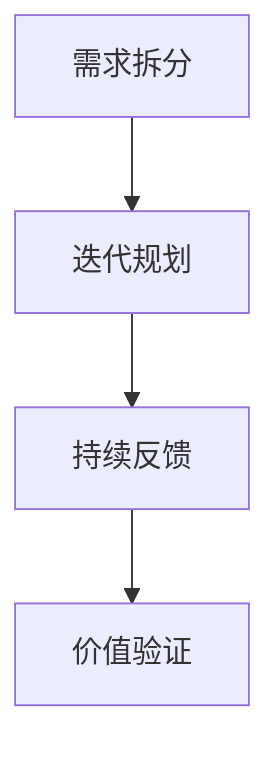
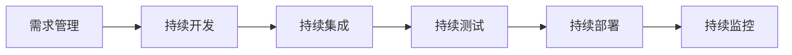

---

设计和优化研发流程需以**价值流动效率最大化**为目标，结合敏捷开发与DevOps核心理念，构建端到端的持续交付体系。以下是经过工业级验证的实施框架，融入京东、华为等企业的最佳实践：

---

### **一、敏捷开发：从「迭代交付」到「业务驱动」**
#### **1. 流程设计四步法**


1. **需求拆分（INVEST原则）**
    - **Independent**：独立用户故事（如"作为采购员，希望批量导入供应商信息"）
    - **Negotiable**：可协商实现方式
    - **Valuable**：业务价值明确（用WSJF加权排序）
    - **Estimable**：可估算工作量（故事点或理想人天）
    - **Small**：颗粒度控制在2-5人天
    - **Testable**：验收条件可验证

2. **迭代规划（双周冲刺模板）**
   ```markdown
   | 阶段          | 关键活动                          | 产出物                   |
   |---------------|----------------------------------|--------------------------|
   | Sprint计划会   | 故事点估算、任务分配               | Sprint Backlog           |
   | 每日站会       | 15分钟同步进展/障碍                | 障碍清单                 |
   | 迭代评审       | Demo可交付成果                    | 客户反馈报告             |
   | 回顾会议       | 根本原因分析（5 Why）             | 改进Action               |
   ```

3. **规模化敏捷（SAFe框架）**
    - **ART（敏捷发布火车）**：8-12个敏捷团队协同交付大型解决方案
    - **PI（项目增量）规划**：每季度举行2天跨团队对齐会议
    - **案例**：工业供应链中台采用SAFe，交付周期缩短40%

---

### **二、DevOps体系：构建「持续价值流」**
#### **1. 端到端流水线设计**


1. **工具链整合（参考CNCF全景图）**  
   | 阶段           | 工具示例                          | 关键指标                  |
   |----------------|----------------------------------|--------------------------|
   | 代码管理       | GitLab（MR+Code Review）         | MR合并耗时               |
   | CI/CD          | Jenkins/GitLab CI                | 构建成功率               |
   | 配置管理       | Ansible/Terraform                | 环境部署一致性           |
   | 监控告警       | Prometheus+Grafana               | MTTR（平均恢复时间）     |

2. **黄金流水线标准**
    - **质量门禁**：
        - 单元测试覆盖率 ≥80%
        - SonarQube代码异味清零
        - 安全扫描（OWASP Top 10）零高危漏洞
    - **部署策略**：
        - 蓝绿部署（生产流量切换）
        - 金丝雀发布（5%流量灰度验证）

3. **工业实践案例**
    - **挑战**：供应链系统月均部署次数仅2次，需求积压严重
    - **优化**：
        - 搭建基于K8s的容器化流水线
        - 引入ArgoCD实现声明式GitOps
    - **成果**：部署频率提升至日均20次，发布故障率下降70%

---

### **三、流程度量与持续改进**
#### **1. DORA四大核心指标**
| 指标              | 健康阈值         | 测量工具               |
|-------------------|------------------|------------------------|
| 部署频率          | 精英级：日均多次  | DevOps Research评估表  |
| 变更前置时间      | <1小时           | Value Stream Mapping   |
| 变更失败率        | <15%            | 监控系统事件日志        |
| 服务恢复时间      | <1小时           | 告警响应时间统计        |

#### **2. 价值流分析（VSM）**
```markdown
1. 识别端到端阶段：需求提出→代码提交→测试完成→生产发布  
2. 测量各阶段时长与等待时间  
3. 计算流程效率：  
   流程效率 = 增值时间 / 总周期时间 ×100%  
   （目标>30%，初始通常<10%）  
4. 优化瓶颈点：如测试环境申请平均等待8小时→引入自助式环境管理平台
```

#### **3. 改进回溯会（Retrospective 2.0）**
- **六顶思考帽法**：  
  | 角色       | 关注点                          |  
  |------------|---------------------------------|  
  | 白帽（事实）| 展示DORA指标变化趋势            |  
  | 红帽（感受）| 团队对流程变更的情绪反馈          |  
  | 黄帽（积极）| 成功经验总结（如自动化测试提升）  |  
  | 黑帽（风险）| 现存问题分析（代码评审效率低下）  |  
  | 绿帽（创新）| 提出改进方案（AI辅助代码审查）    |  
  | 蓝帽（控制）| 制定下一步Action                |

---

### **四、文化与组织适配**
#### **1. 团队拓扑学应用**
| 团队类型         | 职责                          | 流程适配                 |
|------------------|-------------------------------|--------------------------|
| 流式对齐团队     | 端到端交付完整功能              | Scrum+Kanban混合         |
| 赋能型团队       | 提供平台工具（如低代码平台）      | 产品制运营（OKR驱动）     |
| 复杂子系统团队   | 攻坚核心技术（如推荐算法）        | 长周期迭代（6-8周）       |

#### **2. 工程师体验优化**
- **开发体验（DX）提升**：
    - 本地环境一键启动（docker-compose up）
    - 提交代码后15分钟内获得CI反馈
    - 生产问题排查工具链集成（日志查询+链路追踪）
- **心理安全建设**：
    - 每月「无责故障分析会」
    - 建立「勇于试错」创新基金

---

### **五、技术趋势融合**
1. **AI赋能研发流程**
    - **需求生成**：LLM自动拆分用户故事（如GitHub Copilot for PM）
    - **智能测试**：Diffblue自动生成单元测试用例
    - **故障预测**：ML模型分析日志预测系统风险

2. **云原生深度集成**
    - **Serverless CI/CD**：AWS CodePipeline + Lambda实现按需构建
    - **混沌工程即服务**：Gremlin集成到流水线，自动注入故障

---

### **总结**
研发流程优化=**敏捷价值驱动 × DevOps工程实践 × 数据度量反馈**  
关键实施路径：
1. **价值流可视化**：用VSM暴露真实瓶颈
2. **工程卓越筑基**：黄金流水线+质量内建
3. **文化先行**：建立「持续改进」心智模式
4. **技术杠杆**：引入AI/云原生加速创新

可参考微软「One Engineering System」理念，构建从供应链到研发的端到端数字化流程，支撑工业品B2B生态的快速进化。