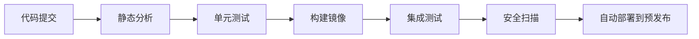

---

为确保代码质量和项目交付时间，需采用系统化的工程实践与管理策略，结合自动化工具与敏捷方法论，以下是具体实施方案：

---

### **一、代码质量保障体系**
#### **1. 代码规范与静态分析**
- **工具集成**：
    - **SonarQube**：配置规则集（如CWE Top 25、OWASP Top 10），强制阻断违规代码合入。
    - **EditorConfig + Prettier**：统一IDE格式化规则，减少风格争议。
- **示例配置**：
  ```yaml
  # .sonar-project.properties
  sonar.issue.ignore.multicriteria=e1,e2
  sonar.issue.ignore.e1.ruleKey=java:S1144
  sonar.issue.ignore.e1.resourceKey=**/*.java
  ```

#### **2. 自动化测试策略**
| **测试类型**   | **工具链**            | **覆盖率目标** | **执行频率**       |
|----------------|-----------------------|----------------|--------------------|
| 单元测试       | JUnit(Java)/pytest(Python) | ≥80%           | 每次代码提交        |
| 集成测试       | Testcontainers        | ≥70%           | 每日定时构建        |
| E2E测试        | Cypress/Selenium      | ≥50%           | 预发布环境部署前    |

- **测试加速**：
    - 并行测试（如pytest-xdist）缩短执行时间。
    - 使用Mock Server（WireMock）隔离外部依赖。

#### **3. 代码审查工业化**
- **流程设计**：
    1. **小型MR**：单次提交不超过500行代码。
    2. **双人评审**：至少2人Approval方可合并。
    3. **AI辅助**：GitHub Copilot生成审查意见，DeepCode识别潜在漏洞。
- **效率指标**：
    - MR平均周转时间 <4小时
    - 注释密度（Comments/KLOC）>3

#### **4. 持续集成/交付（CI/CD）**

- **关键配置**：
    - **分段重试**：单元测试失败时仅重试受影响模块。
    - **流水线熔断**：关键阶段（如安全扫描）失败自动阻断后续流程。

---

### **二、项目交付时间管控**
#### **1. 敏捷规划四步法**
1. **需求分级**：
    - **MoSCoW模型**：Must Have（占60%容量）、Should Have（20%）、Could Have（15%）、Won't Have（5%缓冲）。
2. **任务估算**：
    - **三点估算法**：乐观值(O)、最可能值(M)、悲观值(P)，计算期望值=(O+4M+P)/6。
3. **迭代排期**：
    - **容量规划**：开发速度（Velocity）历史数据驱动，如团队平均完成30故事点/迭代。
4. **风险储备**：
    - 预留总工期的15%-20%作为应急缓冲。

#### **2. 进度监控与纠偏**
- **可视化工具**：
    - **Jira燃尽图**：每日更新剩余工作量，识别进度偏差。
    - **Grafana看板**：集成GitLab、Jenkins数据，实时展示构建成功率、测试通过率。
- **纠偏策略**：  
  | **偏差程度** | **响应措施**                     |
  |--------------|----------------------------------|
  | <5%          | 调整任务优先级，利用缓冲时间       |
  | 5%-15%       | 启动每日站会特别复盘，追加资源     |
  | >15%         | 触发变更控制流程（CCB），削减范围  |

#### **3. 风险管理矩阵**
| **风险类型**   | **概率** | **影响** | **应对策略**                     |
|----------------|----------|----------|----------------------------------|
| 第三方接口延迟 | 高       | 中       | 提前签订SLA，开发Mock服务备用      |
| 关键技术验证失败 | 中       | 高       | 设立Spike任务，迭代0阶段技术预研   |
| 核心成员流失   | 低       | 极高     | 建立Bus Factor≥2，定期交叉培训     |

---

### **三、工业级实践案例**
#### **案例：工业订单系统重构**
- **挑战**：
    - 代码复杂度高（Cyclomatic Complexity >50），导致缺陷修复耗时递增。
    - 交付压力大，需在6个月内完成迁移且零停机。
- **解决方案**：
    1. **质量加固**：
        - 引入SonarQube每日扫描，技术债清理专项迭代（2周/次）。
        - 单元测试覆盖率从40%提升至85%。
    2. **交付管控**：
        - 采用特性开关（Feature Toggles）逐步灰度上线。
        - 基于历史Velocity（35点/迭代）倒排里程碑。
- **成果**：
    - 生产缺陷数下降70%，按期交付并节约20%缓冲资源。

---

### **四、工具链推荐**
| **领域**       | **工具**                          | **核心能力**                     |
|----------------|-----------------------------------|----------------------------------|
| 代码质量管理   | SonarQube + Checkstyle           | 静态分析、技术债务追踪             |
| 自动化测试     | Jest + Postman + Selenium         | 多层级测试覆盖                   |
| CI/CD          | GitLab CI + ArgoCD               | 云原生流水线、GitOps             |
| 项目管理       | Jira + BigPicture                | 敏捷规划、跨团队依赖可视化         |

---

### **总结**
确保代码质量与交付时间的核心在于**工程实践的标准化**与**数据驱动的决策**：
1. **质量内建**：将测试、审查、静态分析嵌入研发流水线，缺陷左移。
2. **透明化管理**：通过可视化工具实时暴露风险，快速响应。
3. **弹性规划**：基于历史数据动态调整，预留缓冲应对不确定性。

**实施口诀**：
- 代码提交即扫描，质量门禁自动化
- 需求分级控范围，风险预案早规划
- 迭代进度数据化，偏差超限快纠偏
- 工具链上提效率，文化落地保执行

通过将丰田精益制造原则（Just-In-Time）与Google DORA工程实践结合，可构建高可靠、高速度的研发体系，支撑工业等大型企业复杂系统的持续交付。