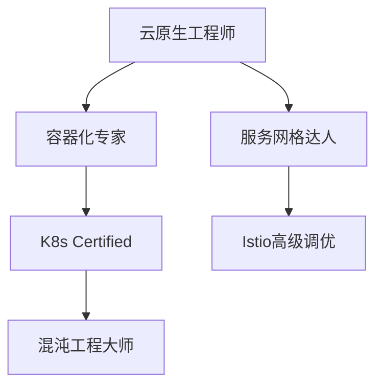

激励团队保持技术热情需要构建**多维驱动体系**，将个人成长、技术挑战、组织认可有机结合。以下是经过硅谷与中国头部科技公司验证的实战方案：

---

### **一、技术文化塑造：打造「极客引力场」**
#### **1. 创新沙盒机制**
- **20%自由时间政策**（Google模式升级版）：
    - 允许每周1天投入自选技术课题（如探索量子计算在供应链的应用）
    - 成果转化：优秀项目纳入KPI考核，专利归属采用"公司-个人7:3分成"
- **黑天鹅实验室**：
    - 设立专项基金支持高风险技术预研（如**工业的"无人仓储机器人"早期孵化）

#### **2. 技术布道体系**
- **荣誉认证**：

  | **称号**         | **获取条件**                      | **特权**                     |
  |--------------|-------------------------------|--------------------------|
  | 首席极客     | 年度技术影响力Top3             | 专属研究预算+海外峰会名额|
  | 开源先锋     | 主导1个Apache顶级项目贡献       | 技术决策委员会席位        |
  | 架构师联盟   | 通过T4级架构评审               | 跨部门技术资源调度权      |

- **技术影响力运营**：
    - 内部TED式演讲（TechStorm大会）
    - 鼓励撰写技术博客（每篇获1000+阅读奖励云计算资源）

---

### **二、成长加速引擎：构建「技术跃迁通道」**
#### **1. 技能图谱与学习工场**

- **认证体系**：
    - 内部技术等级认证（T1-T5）与薪酬职级强绑定
    - 外部认证补贴（如AWS认证考试费全额报销）

#### **2. 技术轮岗计划**
- **跨域实战**：

  | 轮岗类型       | 目标                          | 案例                          |
  |----------------|-------------------------------|-------------------------------|
  | 前沿探索       | 量子计算/AIGC                 | 参与京东智能客服大模型训练     |
  | 技术扶贫       | 支援落后系统改造              | 重构10年老订单系统            |
  | 开源远征       | 主导Apache项目贡献            | 向Kafka社区提交核心模块优化    |

---

### **三、挑战性目标设定：点燃「技术征服欲」**
#### **1. 极限性能挑战赛**
- **赛题设计**：
  ```markdown
  ## 2023工业中间件性能大赛
  **目标**：在4核8G云主机实现百万级TPS订单处理  
  **规则**：  
  - 允许使用任何开源框架  
  - 最终排名=TPS×能效比（QPS/CPU核）  
  **奖项**：  
  - 冠军团队获得48小时硅谷技术考察  
  - 创新方案直接应用于生产环境  
  ```

#### **2. 红蓝军对抗演练**
- **攻防场景**：
- 
  | 攻击方                 | 防御方                 | 技术焦点               |
  |------------------------|------------------------|------------------------|
  | 模拟双十一流量洪峰      | 保障系统零宕机          | 弹性伸缩+熔断策略       |
  | 注入APM监控盲点        | 构建全链路可观测        | OpenTelemetry埋点优化   |

---

### **四、物质与精神双驱动**
#### **1. 技术股权激励**
- **贡献量化模型**：
  ```math
  技术积分 = 代码贡献度 × 复杂度系数 + 专利数量 × 影响力系数 + 故障解决数 × 紧急度系数
  ```
    - 年度积分Top10获得限制性股票奖励

#### **2. 极客荣耀体系**
- **数字徽章系统**：

  | 徽章           | 获取条件                      | 虚拟权益                 |
  |----------------|-------------------------------|--------------------------|
  | 性能屠龙者      | 打破3项基准测试纪录            | 专属服务器命名权         |
  | 漏洞猎人        | 发现5个高危安全漏洞            | 网络安全大使称号         |
  | 开源之星        | 社区PR被合并次数超50           | 自定义GitHub成就徽章     |

- **物理勋章**：钛合金铸造技术成就勋章，年度颁奖典礼授予

---

### **五、环境与工具赋能**
#### **1. 极客工作台**
- **硬件配置**：
    - 顶配开发机（128G内存+RTX4090）
    - 可选操作系统：Linux发行版/FreeBSD
- **软件特权**：
    - 直接访问生产环境Trace（权限白名单）
    - ChatGPT-4/GitHub Copilot企业版账号

#### **2. 技术雷达建设**
- **前沿技术试点**：

  | 技术领域       | 试点团队          | 商业转化路径                |
  |----------------|-------------------|-----------------------------|
  | WebAssembly    | 供应链预测团队     | 浏览器端实时计算性能提升40%  |
  | eBPF           | 基础设施团队       | 网络观测粒度从应用级到函数级 |

---

### **六、工业实战案例**
#### **案例：物流算法团队热情激活**
- **痛点**：
    - 长期处理传统路径优化，技术新鲜感下降
    - 顶尖人才被互联网大厂高薪挖角
- **解决方案**：
    1. **设立「无人配送」创新赛道**：团队可竞标参与无人机/无人车算法研发
    2. **技术成果拍卖**：将算法模块封装为API，内部其他团队用虚拟币"采购"
    3. **极客电影节**：用Three.js可视化算法运行过程角逐最佳技术艺术奖
- **成果**：
    - 核心人才流失率下降60%
    - 产生3项自动驾驶领域专利

---

### **总结**
保持技术热情=**构建「技术游乐场」× 设计「荣耀战场」× 提供「进化火箭」**  
关键行动原则：
1. **让技术有趣**：将日常工作游戏化（如将代码提交转化为星球大战主题）
2. **让成长可见**：技能树系统+数字徽章实时反馈进步
3. **让挑战性感**：设置需要跳起来才能够到的技术目标
4. **让价值流通**：技术贡献可量化兑换资源/荣誉/股权

通过将Valve的扁平自治文化与华为"蒙哥马利计划"结合，可打造出自我驱动的技术军团，为工业等企业持续输送创新动能。