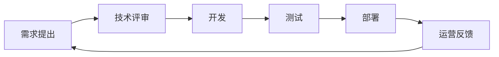

在跨部门协作中，研发团队需构建**端到端的价值交付网络**，通过目标对齐、流程再造、工具协同和文化渗透四大维度实现高效协作。以下是经过京东、阿里等企业验证的实战方案：

---

### **一、目标对齐：构建「北极星指标」共同体**
#### **1. 联合OKR设计**
| 部门       | 传统目标                          | 协同OKR设计                          |
|------------|----------------------------------|---------------------------------------|
| 产品       | 需求交付数量                      | 用户故事验收通过率（研发参与定义DoD）  |
| 测试       | Bug解决速度                      | 缺陷预防率（左移测试参与架构评审）     |
| 运营       | 活动上线数量                     | 功能投产后的业务指标达成率（如转化率） |

**工业实践**：供应链预测系统升级时，产品-研发-运营共同承诺「预测准确率提升15%」的核心KR，测试团队将验收标准细化为200+场景覆盖。

#### **2. 价值流可视化**

- **跨部门站会**：每周举行30分钟「价值流健康度检视」，关注各环节流转效率
- **瓶颈预警**：使用Kanban的WIP限制（如开发中任务≤50），触发部门协同干预

---

### **二、流程再造：构建「无摩擦」协作管道**
#### **1. 需求全生命周期管理**
| 阶段         | 协作机制                      | 工具支持                   | 关键产出                  |
|--------------|-----------------------------|---------------------------|--------------------------|
| 需求发现     | 联合用户旅程地图（JTBD）工作坊 | Miro在线白板              | 用户痛点优先级矩阵        |
| 技术评审     | 三方评审（产品+研发+测试）     | ADR（架构决策记录）模板    | 技术可行性报告            |
| 交付验收     | 行为驱动开发（BDD）           | Cucumber+Jira关联用例      | 自动化验收测试集          |

**流程创新案例**：工业在供应链系统改造中引入「反讲机制」——产品经理需用技术术语复述需求，减少理解偏差。

#### **2. 紧急事件响应协议**
- **SLA分级机制**：
  | 事件等级 | 响应时间 | 参与方                     | 升级路径               |
  |----------|----------|----------------------------|------------------------|
  | P0       | 15分钟   | 研发TL+测试经理+产品总监    | 直接触发War Room       |
  | P1       | 1小时    | 研发接口人+测试工程师       | 每日执行副总裁简报     |
  | P2       | 4小时    | 值班工程师                  | 周报汇总               |

- **线上故障三板斧**：
    1. 全链路日志秒级检索（ELK+TraceID）
    2. 自动化回滚流水线（5分钟恢复基线版本）
    3. 跨部门复盘会（24小时内产出Action）

---

### **三、工具协同：构建「数字孪生」工作空间**
#### **1. 全栈协作工具链**
| 协作维度     | 工具组合                          | 集成策略                  |
|--------------|----------------------------------|--------------------------|
| 需求管理     | Jira+Confluence+FigJam           | Epics→Tasks自动分解       |
| 代码协作     | GitLab+SonarQube+SwaggerHub       | MR关联需求+静态分析报告    |
| 测试管理     | TestRail+Xray+Postman            | 用例与代码分支自动绑定     |
| 部署运营     | ArgoCD+Datadog+PagerDuty         | 发布单关联监控仪表盘       |

**工业实践**：通过OpenAPI将供应链系统的库存接口实时同步至运营数据中台，运营人员可直接在Tableau配置预警规则。

#### **2. 自动化握手协议**
- **研发→测试**：代码合并触发自动化测试包生成，结果自动同步至Teambition
- **测试→运维**：通过Jenkins Pipeline将压测报告转换为扩容策略建议
- **运营→产品**：用户行为分析数据自动生成A/B测试需求卡片

---

### **四、文化渗透：打破「部门谷仓」**
#### **1. 人员轮岗计划**
| 轮岗类型     | 目标                          | 案例                        |
|--------------|-------------------------------|-----------------------------|
| 技术BP       | 研发骨干派驻产品团队3个月       | 参与工业App用户画像重构     |
| 运营体验官   | 测试工程师跟进线上活动全流程    | 发现促销系统库存同步漏洞      |
| 产品技术日   | 非技术人员参与代码Dojo活动      | 产品经理编写首个Hello World  |

#### **2. 跨部门激励设计**
- **联合KPI**：供应链预测准确率提升同时计入算法团队和运营团队绩效
- **创新积分池**：跨部门协作产生的专利，奖金按贡献度分配
- **文化勋章体系**：设立「桥梁建造者」奖，由CEO季度颁奖

---

### **五、效能度量与持续改进**
#### **1. DORA增强指标**
| 指标              | 采集维度                      | 改进方向                  |
|-------------------|-------------------------------|--------------------------|
| 需求前置时间      | 从产品需求创建到技术评审通过    | 优化需求澄清机制          |
| 跨部门阻塞时长    | 任务在部门间排队等待时间        | 建立SLA响应制度          |
| 功能投产价值      | 上线后30天业务指标达成率        | 加强运营反馈闭环          |

#### **2. 价值流分析（VSM+）**
- **案例**：工业订单系统改造前价值流效率仅8%，通过优化跨部门评审机制提升至22%
  ```mermaid
  graph LR
    A[原始流程 100天] --> B[产品需求池 30天]
    B --> C[技术评审 15天]
    C --> D[开发 40天]
    D --> E[测试 10天]
    E --> F[部署 5天]
    F --> G[价值流效率=40/100=40%]
    
    A1[优化后流程 60天] --> B1[需求预审 7天]
    B1 --> C1[敏捷评审 3天]
    C1 --> D1[持续交付 40天]
    D1 --> E1[自动化测试 5天]
    E1 --> F1[蓝绿发布 5天]
    F1 --> G1[价值流效率=40/60=66.7%]
  ```

---

### **总结**
高效跨部门协作=**目标共同体×流程握手点×工具连接器×文化催化剂**  
关键实施原则：
1. **从指标对抗到价值共享**：建立联合OKR与收益分成机制
2. **从人工协调到自动化握手**：通过工具链实现跨系统事件驱动
3. **从部门墙到能力网络**：通过轮岗与联合项目培养T型人才

工业可参考亚马逊的"Two-Pizza Team"原则与华为的"铁三角"模式，构建以业务价值为焦点的敏捷协作网络，支撑工业品B2B生态的高速进化。