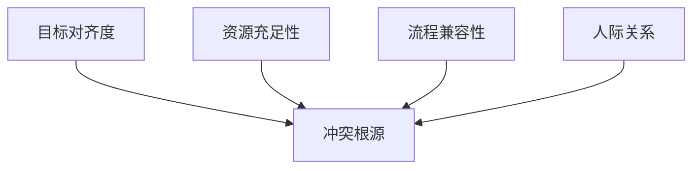

---

处理跨部门冲突需采取**系统化干预策略**，从冲突预防、实时化解到长效治理逐层推进。以下是结合亚马逊、华为等企业实践的解决方案：

---

### **一、冲突根源诊断与分类**
#### **1. 冲突类型矩阵**
| **冲突类型**       | **典型场景**                      | **核心矛盾**                |
|--------------------|----------------------------------|---------------------------|
| **目标性冲突**      | 研发追求技术卓越 vs 产品追求快速上线 | 价值取向差异               |
| **资源性冲突**      | 市场部需紧急活动支持 vs 研发人力不足 | 有限资源分配               |
| **流程性冲突**      | 测试要求完整文档 vs 敏捷团队习惯口头沟通 | 协作规范不统一             |
| **关系性冲突**      | 历史遗留矛盾导致协作障碍            | 信任缺失与情绪对抗          |

#### **2. 四维诊断工具**


---

### **二、冲突解决六步法**
#### **Step 1：建立中立沟通场域**
- **会前准备**：
    - 冲突双方向第三方协调人（如PMO）提交立场陈述书
    - 使用Miro绘制利益相关者影响地图
- **会议规则**：
    - 禁止人身攻击，聚焦事实与数据
    - 采用"发言权杖"（仅持物者可发言）

#### **Step 2：重构问题表述**
- **从对抗到合作**：  
  原始表述："市场部总是提不合理需求"  
  重构表述："我们如何平衡创新活动与技术可行性？"

#### **Step 3：利益深层挖掘**
- **五问法**溯源：
  ```
  Q1：为什么必须在本季度上线该功能？  
  A：为获取行业标杆客户  
  Q2：为什么该客户如此重要？  
  A：可带来2000万年度订单  
  ...（直至触及战略级目标）  
  ```

#### **Step 4：创新解决方案设计**
- **头脑风暴工具**：
    - **逆向思维法**：如果资源无限，理想的解决方案是？
    - **跨界嫁接法**：其他行业如何解决类似问题？（如航空业超售策略启发资源分配）

#### **Step 5：可行性验证与选择**
- **决策矩阵**（示例）：  
  | 方案          | 战略契合度 | 实施成本 | 风险系数 | 综合得分 |
  |---------------|------------|----------|----------|----------|
  | 外包开发       | 6          | 8        | 7        | 21       |
  | 简化MVP方案   | 9          | 6        | 4        | **19**   |
  | 资源置换       | 7          | 5        | 6        | 18       |

#### **Step 6：执行与反馈闭环**
- **SLA制定**：
  ```markdown
  ## 市场-研发协作SLA
  - 紧急需求响应：<4小时可行性评估  
  - 资源置换机制：借调1名研发=市场部提供2次客户深度洞察  
  - 争议升级路径：3次协商未果提交CTO办公室  
  ```

---

### **三、冲突预防机制**
#### **1. 战略解码工作坊**
- **工具应用**：
    - **平衡计分卡**：将公司战略分解为部门级KPI，确保目标同源
    - **跨部门OKR对齐会**：季度初举行2天封闭会议，使用Jira Align可视化依赖关系

#### **2. 资源动态分配机制**
- **资源云化管理**：  
  | 资源类型       | 共享策略                      | 监控指标                  |
  |----------------|-------------------------------|--------------------------|
  | 研发人力       | 内部项目市场制（虚拟币竞拍）   | 资源利用率波动率          |
  | 服务器资源     | 弹性配额+超额使用阶梯计价      | 空闲资源回收率            |

#### **3. 流程握手点设计**
- **RACI矩阵优化**：  
  | 流程阶段       | 市场部        | 研发部        | 财务部       |
  |----------------|--------------|--------------|--------------|
  | 需求评审       | R            | A            | C            |
  | 预算审批       | C            | R            | A            |
  | 上线验收       | A            | R            | I            |

---

### **四、组织文化重塑**
#### **1. 冲突转化训练**
- **红蓝军对抗赛**：
  ```markdown
  ## 供应链系统优化辩论赛
  正方：应优先保证系统稳定性  
  反方：应快速响应客户定制需求  
  评判标准：商业价值论证深度+技术可行性分析  
  ```

#### **2. 跨部门同理心建设**
- **岗位互换计划**：  
  | 岗位           | 时长       | 产出要求                  |
  |----------------|------------|--------------------------|
  | 研发→产品      | 2周        | 完成1个用户故事地图       |
  | 测试→运营      | 1周        | 输出1份用户体验分析报告   |

#### **3. 协作仪式设计**
- **跨部门勋章体系**：  
  | 勋章           | 获取条件                      | 特权                     |
  |----------------|-------------------------------|--------------------------|
  | 桥梁建造者     | 促成3次以上跨部门合作          | 优先晋升考虑             |
  | 协同创新奖     | 跨部门项目产生专利             | 额外年假+技术大会名额     |

---

### **五、工业实战案例**
#### **案例：智能仓储系统资源争夺战**
- **冲突背景**：  
  物流部门要求3个月内上线机器人调度系统，研发部门因人力紧张拒绝
- **解决过程**：
    1. **需求重构**：发现核心诉求是"双十一前提升分拣效率30%"
    2. **创新方案**：采用开源ROS框架+现有硬件改造，节省70%开发量
    3. **资源置换**：物流部门抽调2名业务专家全程参与需求细化
- **成果**：  
  准时上线并超额达成目标（效率提升35%），冲突双方获年度最佳协作奖

---

### **六、冲突管理工具包**
| **工具类型**     | **推荐工具**                  | **应用场景**               |
|------------------|-------------------------------|--------------------------|
| 可视化协作       | Mural/Miro                   | 远程冲突调解              |
| 情绪识别         | Hume AI情绪分析               | 会议氛围实时监控           |
| 自动化记录       | Otter.ai会议转录              | 避免决议误解               |
| 冲突预测         | Jira + 机器学习模型           | 基于历史数据预警高风险项目  |

---

### **总结**
高效处理跨部门冲突=**精准诊断×结构化流程×文化免疫**  
关键行动原则：
1. **从灭火到防火**：80%精力投入冲突预防机制建设
2. **化冲突为创新**：通过对抗性讨论激发更好解决方案
3. **用数据替代情绪**：建立事实驱动的决策文化
4. **让协作可触摸**：设计仪式感强的正向激励

可参考微软"非暴力沟通"工作坊与阿里"双轨绩效"机制，构建既能保持部门锐度又能实现高效协同的组织生态，驱动工业数字化转型升级。