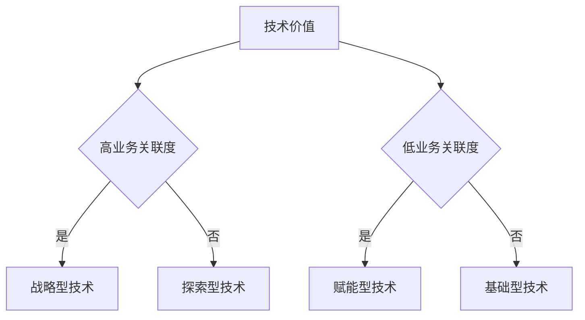

平衡短期业务需求与长期技术积累是企业持续创新的核心挑战，需要构建**战略驱动的资源分配体系**，通过机制设计实现动态平衡。以下是经过验证的系统化解决方案，结合亚马逊、**工业等企业的实践案例：

---

### **一、战略分解：构建技术-业务映射矩阵**
#### **1. 技术投资四象限模型**

- **战略型技术**（如**工业的AI商品参数引擎）：
    - 投入占比50%，与核心业务强耦合，短期可见效
- **赋能型技术**（如低代码平台）：
    - 投入占比30%，提升全团队效率，降低业务试错成本
- **基础型技术**（如云原生架构升级）：
    - 投入占比15%，确保系统可扩展性与稳定性
- **探索型技术**（如量子计算应用预研）：
    - 投入占比5%，布局未来可能性

#### **2. OKR对齐机制**
- **业务部门OKR示例**：
  > O：Q3工业品GMV增长20%  
  > KR1：上线智能推荐功能（依赖战略型技术）  
  > KR2：供应商接入效率提升30%（依赖赋能型技术）

- **技术团队OKR示例**：
  > O：构建下一代供应链技术中台  
  > KR1：完成微服务架构迁移（支撑未来3年业务扩展）  
  > KR2：AI预测准确率提升至95%（直接驱动GMV增长）

---

### **二、资源分配：双轨制投资模型**
#### **1. 70-20-10资源配比**
- **70%资源**：投入已验证的技术方向，快速响应业务需求
    - 示例：**工业的MRO智能采购系统迭代
- **20%资源**：用于技术中台建设，降低重复开发成本
    - 示例：构建通用商品数据标准化引擎
- **10%资源**：布局前沿探索（如工业元宇宙场景）

#### **2. 敏捷迭代与季度规划**
- **双周冲刺规划**：  
  | **迭代类型** | **时间分配** | **交付目标**               |
  |--------------|--------------|----------------------------|
  | 业务需求迭代 | 60%          | 功能快速上线，满足季度KPI   |
  | 技术专项迭代 | 30%          | 架构优化、性能提升          |
  | 创新实验迭代 | 10%          | 原型验证，储备未来技术      |

- **季度技术峰会**：
    - 评估技术债务与架构健康度
    - 调整下季度资源分配比例（如业务压力大时临时调整为80-15-5）

---

### **三、技术债务管理：预防与清偿并重**
#### **1. 债务量化评估模型**
- **技术债务指数** = (代码重复率×0.3) + (测试覆盖率缺口×0.4) + (架构复杂度×0.3)
- **分级处理策略**：  
  | **债务等级** | 指数范围 | 处理方案                     |
  |--------------|----------|------------------------------|
  | 红色         | >0.8     | 停服修复，最高优先级          |
  | 橙色         | 0.6-0.8  | 下个迭代必须解决              |
  | 黄色         | 0.4-0.6  | 季度技术债日集中处理          |
  | 绿色         | <0.4     | 日常编码规范预防              |

#### **2. 债务清偿机制**
- **Tech Debt Sprint**：每月预留2天专门处理技术债务
- **架构守护者角色**：指定资深工程师在代码评审中拦截新增债务

---

### **四、组织与文化：构建创新友好环境**
#### **1. 绩效双轨制设计**
- **短期激励**：
    - 业务需求交付速度（如需求平均周期<7天）
    - 线上故障率（SLA达成率≥99.9%）
- **长期激励**：
    - 技术专利数量（年度≥5项）
    - 架构健康度提升（技术债务指数下降20%）

#### **2. 创新容错机制**
- **黑天鹅实验室**：允许10%时间用于高风险技术试验，失败项目需输出《技术预研报告》
- **技术影响力积分**：参与开源贡献、技术布道可兑换培训资源或晋升加分

---

### **五、工具链支持：自动化提效**
#### **1. 效率工具矩阵**
| **工具类型**   | **代表工具**            | **提效场景**                |
|----------------|-------------------------|----------------------------|
| 低代码平台     | 阿里宜搭/腾讯微搭        | 快速构建业务后台，释放研发资源 |
| AI辅助开发     | GitHub Copilot          | 代码生成效率提升55%         |
| 自动化测试     | Selenium+Jenkins        | 测试人力投入减少70%         |

#### **2. 数据驱动决策**
- **技术投资看板**：集成Jira、GitLab、财务系统数据，实时展示各技术方向ROI
- **业务影响预测模型**：通过历史数据预测技术升级带来的GMV增长曲线

---

### **六、**工业实践案例**
#### **案例：供应链预测系统升级**
- **短期需求**：3个月内提升预测准确率5个百分点
- **长期投入**：构建基于GNN的供应链知识图谱
- **平衡策略**：
    1. 短期：优化现有LSTM模型参数（2人月）
    2. 长期：并行开发GNN原型，通过A/B测试逐步替换
    3. 成果：季度目标达成，同时完成下一代技术储备

---

### **总结**
平衡短长期的核心在于**机制设计**而非简单取舍：
1. **战略清晰**：通过技术-业务映射明确优先级，避免资源分散
2. **动态调节**：季度评估调整投入比例，保持灵活性
3. **文化筑基**：建立尊重技术规律的组织心智，避免唯业务论
4. **工具赋能**：通过自动化降低重复劳动，释放创新资源

**最终目标**：让技术积累成为业务增长的加速器而非成本项，如亚马逊通过AWS技术中台反哺电商业务，**工业以"太璞"平台推动GMV与技术壁垒同步提升。