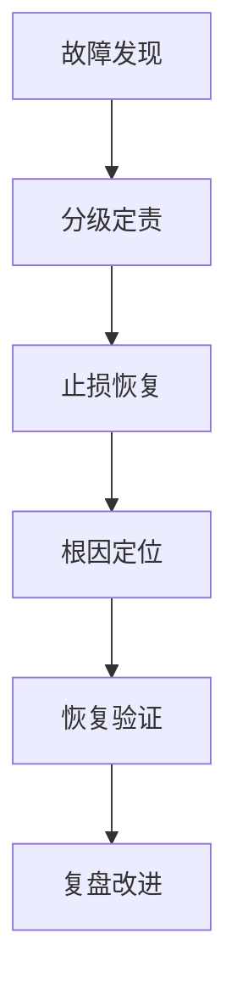

应对系统故障或线上事故需要遵循**标准化、分阶段、多角色协同**的应急响应流程，以最小化业务影响并持续改进系统韧性。以下是经过大型互联网公司验证的系统化处理方案：

---

### **一、事前准备：构建防御体系**
#### **1. 故障分级标准**
| **级别** | **影响范围**            | **响应时效** | **参与角色**                     |
|----------|-------------------------|--------------|----------------------------------|
| P0       | 核心功能全瘫，营收损失>100万/小时 | ≤5分钟       | CTO、架构师、核心开发、运维       |
| P1       | 主要功能模块不可用        | ≤15分钟      | 技术总监、SRE团队、产品负责人     |
| P2       | 非核心功能异常            | ≤1小时       | 值班工程师、测试团队              |

#### **2. 工具链建设**
- **监控告警**：Prometheus+Alertmanager实现5层监控（基础设施/应用/业务/日志/用户体验）
- **应急工具箱**：
  ```markdown
  - 一键服务降级（如关闭推荐算法）
  - 流量调度（AWS Route53故障转移）
  - 日志分析（ELK+TraceID全链路追踪）
  ```

#### **3. 常态化演练**
- **混沌工程**：每月模拟机房断网、数据库主从切换等场景
- **红蓝对抗**：攻防演练检验应急方案有效性（如全链路压测）

---

### **二、事中处置：五步应急流程**


#### **1. 故障发现与通告（0-5分钟）**
- **自动化触发**：  
  监控系统自动创建故障工单，同步至钉钉/飞书应急群
- **通告模板**：
  ```markdown
  [P0告警] 订单支付服务不可用  
  - 开始时间：2023-08-20 14:05  
  - 影响范围：所有渠道支付失败  
  - 当前进展：正在检查数据库连接状态  
  ```

#### **2. 分级定责与应急响应（5-15分钟）**
- **指挥官机制**：指定唯一决策者协调各方资源
- **三板斧止血**：
    1. **服务回滚**：K8s快速回退至稳定版本
    2. **流量调度**：Nginx切走故障区域流量
    3. **降级熔断**：Sentinel关闭非核心功能

#### **3. 根因定位与修复（15-60分钟）**
- **诊断工具链**：  
  | **工具**       | **使用场景**                  |
  |----------------|-----------------------------|
  | Arthas         | JVM级问题诊断（CPU飙升、死锁）|
  | bpftrace       | 内核态性能分析               |
  | Wireshark      | 网络包分析                   |

- **根因定位SOP**：
  ```markdown
  1. 检查监控仪表盘（CPU/内存/磁盘IO）
  2. 查看错误日志（ERROR/WARN级别）
  3. 分析调用链（Jaeger/Zipkin）
  4. 复现验证（测试环境模拟）
  ```

#### **4. 恢复验证与观察（60-120分钟）**
- **渐进式恢复**：
  ```mermaid
  graph LR
    A[10%流量] --> B[监控指标正常]
    B --> C[50%流量]
    C --> D[100%流量]
  ```
- **验证清单**：
    - 核心功能测试用例通过率100%
    - 关键业务指标（支付成功率）恢复至基线

#### **5. 对外沟通与公告**
- **多通道触达**：  
  | **渠道**   | **内容要求**                  | **更新频率**       |
  |------------|-----------------------------|-------------------|
  | 客服系统   | 标准话术+预计恢复时间          | 每30分钟          |
  | 官网公告   | 故障影响范围与补偿方案         | 状态变更时        |
  | 社交媒体   | 简洁进展通报（避免技术细节）    | 每1小时           |

---

### **三、事后复盘：构建改进闭环**
#### **1. 五步复盘法**
```markdown
1. 事实还原：时间线梳理（如Grafana监控截图）
2. 根因分析：5Why法追问至系统层原因
3. 改进措施：技术方案+流程优化双路径
4. 责任认定：区分直接责任与管理责任
5. 知识沉淀：编写事故报告并录入案例库
```

#### **2. 改进项跟踪**
- **Jira工单模板**：  
  | **字段**         | **示例**                      |
  |------------------|-------------------------------|
  | 问题描述         | Redis集群脑裂导致缓存失效     |
  | 根本原因         | 哨兵节点网络分区未配置quorum  |
  | 解决措施         | 升级Redis 6.2+启用ACL认证     |
  | 负责人           | 张工（基础设施组）            |
  | 计划完成时间     | 2023-09-01                   |

#### **3. 系统性防御升级**
- **架构优化**：
    - 单点改造：数据库主从→集群模式
    - 容量规划：基于历史峰值*2预留资源
- **流程加固**：
    - 上线卡点：增加混沌测试准入条件
    - 变更管控：建立灰度发布审批流

---

### **四、**工业实战案例**
#### **案例：工业品采购平台数据库故障**
- **故障现象**：  
  14:05 订单查询响应时间从200ms飙升至15s
- **应急响应**：
    1. 14:07 触发P1告警，自动切换至备用数据库
    2. 14:15 确认主库慢查询堆积，优化索引
    3. 14:40 100%流量恢复，总停机时间35分钟
- **根因分析**：  
  新上线促销模块未做压测，导致全表扫描请求激增
- **长效改进**：
    - 上线SQL审核平台（禁止无索引查询）
    - 建立负载测试准入标准

---

### **五、工具链推荐**
| **类别**       | **推荐工具**                | **核心能力**                  |
|----------------|----------------------------|------------------------------|
| 监控告警       | Prometheus+Alertmanager    | 多维指标监控与智能告警         |
| 日志分析       | ELK（Elastic/Logstash/Kibana） | 分布式日志聚合与检索           |
| 链路追踪       | Jaeger/SkyWalking          | 微服务调用链可视化             |
| 应急协作       | 钉钉应急群+Zoom战争会议室   | 实时沟通与屏幕共享             |

---

### **总结**
高效处理线上事故的关键在于：
1. **标准化流程**：明确分级响应机制，避免混乱
2. **工具链赋能**：通过自动化缩短MTTR（平均修复时间）
3. **文化塑造**：建立不追责（Blame-Free）的复盘文化，鼓励透明化分析
4. **持续改进**：将每次事故转化为系统加固的机会

通过将SRE理念与本土化实践结合（参考Google SRE手册与**工业实战），可构建覆盖预防-响应-改进全周期的故障管理体系，将系统可用性提升至99.99%以上。