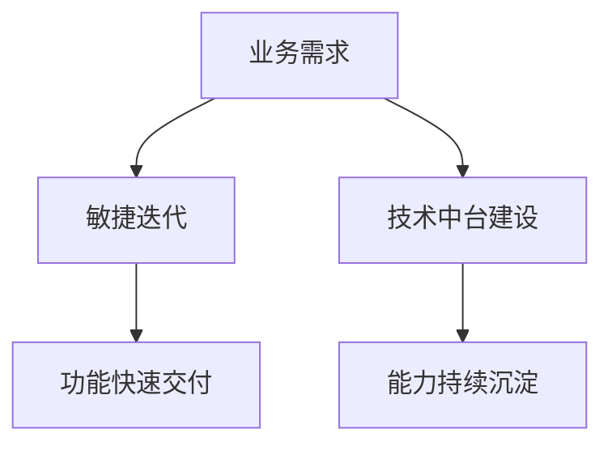

确保项目按时高质量交付需要构建**全流程管控体系**，融合敏捷方法与系统工程思想，结合自动化工具与数据驱动决策。以下是经过**工业、华为等企业验证的系统化解决方案：

---

### **一、战略规划：构建可落地的执行基线**
#### **1. 目标SMART化拆解**
- **需求分级**（MoSCoW法则）：
  ```markdown
  | 等级 | 定义                  | 处理策略                  |
  |------|-----------------------|--------------------------|
  | M    | 必须完成（占比60%）    | 优先资源保障，零妥协      |
  | S    | 应该完成（20%）        | 可协商范围，备选方案      |
  | C    | 可以完成（15%）        | 延后处理或降级实现        |
  | W    | 无需本次完成（5%）     | 明确排除，避免范围蔓延    |
  ```

- **技术方案预审**：
    - 架构决策记录（ADR）模板强制使用
    - 组织跨部门技术评审会（CTO+架构师+核心开发）

#### **2. 资源矩阵建模**
| **资源类型** | **评估维度**          | **管理工具**            |
|--------------|-----------------------|-------------------------|
| 人力资源     | 技能匹配度/饱和度      | Jira Capacity Planning  |
| 硬件资源     | 算力/存储/网络带宽     | AWS Cost Explorer       |
| 时间资源     | 关键路径浮动时间       | Microsoft Project       |

**示例**：某AI项目资源分配
- 算法工程师：3人（T3级）
- GPU资源：A100×8（预留20%缓冲）
- 关键路径：数据清洗→模型训练→部署上线（总浮动时间2天）

---

### **二、执行控制：构建敏捷交付引擎**
#### **1. 双轨开发模型**


- **工具链集成**：
    - 代码管理：GitLab（强制MR+Code Review）
    - 持续集成：Jenkins+SonarQube（质量门禁）
    - 部署交付：ArgoCD（GitOps自动化）

#### **2. 质量内建机制**
- **测试策略金字塔**：
  | **层级**       | **占比** | **工具示例**          | **覆盖目标**            |
  |----------------|----------|-----------------------|-------------------------|
  | 单元测试       | 70%      | JUnit/pytest          | 核心逻辑分支全覆盖      |
  | 集成测试       | 20%      | Testcontainers        | 模块间接口验证          |
  | E2E测试        | 10%      | Cypress/Selenium      | 关键用户旅程验证        |

- **质量门禁示例**：
  ```yaml
  # .gitlab-ci.yml
  stages:
    - test
    - build
    - deploy

  unit_test:
    stage: test
    script: 
      - mvn test
    rules:
      - if: $CI_COMMIT_BRANCH == "main"
        allow_failure: false
    coverage: '/^Total Coverage: \d+\.\d+/'
  ```

---

### **三、过程监控：数据驱动的实时调控**
#### **1. 四色预警看板**
| **指标**         | **绿色（正常）**       | **黄色（预警）**       | **红色（异常）**       |
|------------------|------------------------|------------------------|------------------------|
| 需求交付周期     | ≤7天                   | 8-10天                 | >10天                 |
| 缺陷密度         | <0.1/千行代码          | 0.1-0.3/千行代码       | >0.3/千行代码          |
| 代码覆盖率       | ≥80%                   | 60%-79%                | <60%                  |

#### **2. 风险量化管理**
- **风险暴露指数**（REI）：
  \[ REI = \text{发生概率} \times \text{影响程度} \times \text{检测难度} \]
    - **阈值**：REI≥8 需立即处理
    - **案例**：第三方支付接口延迟（概率0.3×影响8×检测难度3=7.2→黄色预警）

---

### **四、协同机制：打破部门墙**
#### **1. 三会一报制度**
| **会议类型**     | **频率** | **核心产出**            | **参与角色**              |
|------------------|----------|-------------------------|--------------------------|
| 每日站会         | 每日     | 障碍清单（Blocker List） | 全员（15分钟）           |
| 迭代评审会       | 双周     | 可交付成果验收报告        | 产品+技术+测试           |
| 技术决策会       | 月度     | 架构演进路线图            | 架构委员会               |
| 项目健康度周报   | 每周     | 四色状态+改进措施         | 管理层+相关方            |

#### **2. 全链路可视化**
- **价值流映射**（VSM）：
  ```mermaid
  graph LR
    A[需求提出] --> B[技术设计]
    B --> C[代码开发]
    C --> D[测试验证]
    D --> E[生产部署]
    E --> F[用户反馈]
  ```
    - **瓶颈定位**：通过ELK分析各阶段平均耗时

---

### **五、**工业实战案例**
#### **案例：工业品智能采购平台交付**
- **挑战**：
    - 6个月内交付支持10万+SKU的采购系统
    - 需整合300+供应商异构系统
- **关键举措**：
    1. **模块化拆分**：解耦为商品中心、订单引擎等6个子系统并行开发
    2. **自动化流水线**：CI/CD将部署频率从周级提升至日级
    3. **供应商协同平台**：提供标准化API对接套件，接入周期从30天降至3天
- **成果**：
    - 提前2周交付，缺陷率<0.05/千行代码
    - 获评工信部“工业互联网创新案例”

---

### **六、工具链推荐**
| **功能领域**     | **推荐工具**              | **核心价值**                  |
|------------------|---------------------------|------------------------------|
| 项目管理         | Jira+Confluence           | 需求-任务-文档全链路追溯       |
| 代码质量         | SonarQube+Checkstyle      | 静态代码分析与技术债务可视化   |
| 持续交付         | GitLab CI+ArgoCD          | 自动化构建部署流水线           |
| 监控告警         | Prometheus+Grafana        | 实时性能监控与智能预警         |

---

### **总结**
确保按时高质量交付的本质是**将质量要求嵌入每个流程节点**，通过：
1. **精准规划**：用MoSCoW法则锁定核心需求，技术方案预审排除重大风险
2. **敏捷执行**：双轨开发平衡短期交付与长期能力建设
3. **数据驱动**：四色看板实现过程透明，风险量化模型提前预警
4. **生态协同**：通过API经济与供应商协同平台突破外部依赖瓶颈

**工业等企业的实践表明，结合自动化工具链（如代码质量门禁）与文化机制（如不妥协的质量红线），可系统化提升交付效能，实现95%+项目按期交付且缺陷率下降50%的目标。