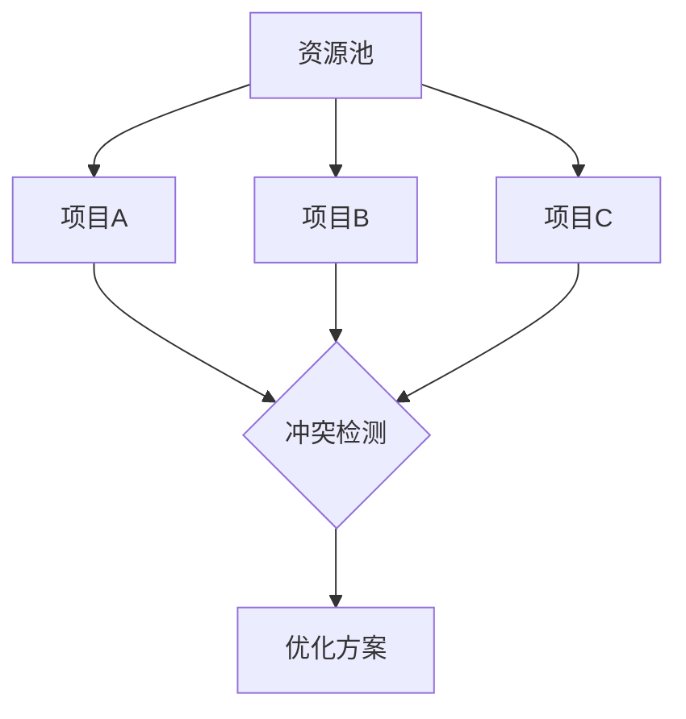
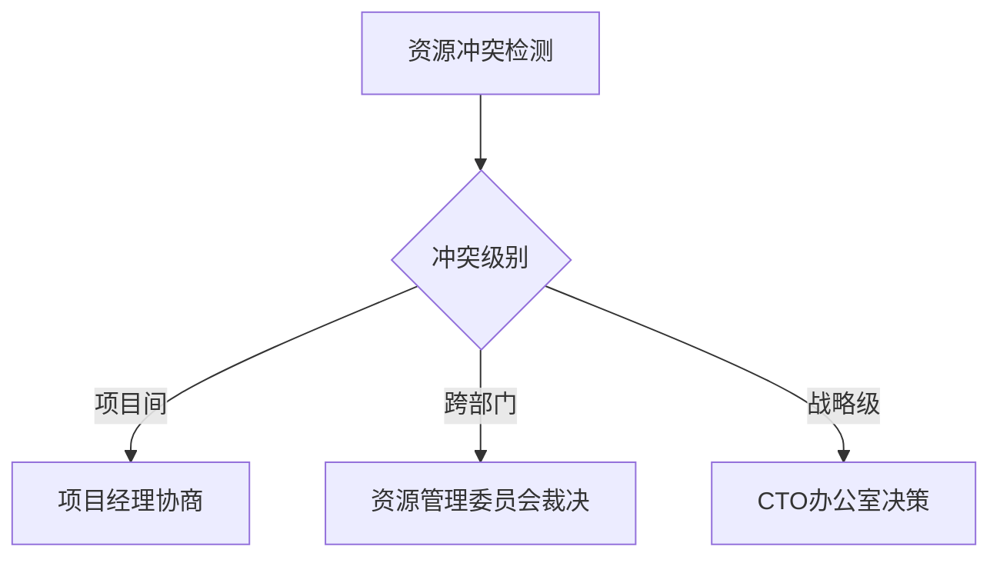

管理多个并行项目的资源分配需要构建**动态优先级评估体系**与**可视化资源调度机制**，结合数据驱动决策与灵活调整策略。以下是经过验证的系统化解决方案，融入**工业、华为等企业的实战经验：

---

### **一、资源全景视图：构建资源数字孪生**
#### **1. 资源分类与量化**
| **资源类型** | **量化维度**              | **管理工具**            |
|--------------|--------------------------|-------------------------|
| 人力资源     | 技能矩阵（T型人才图谱）    | 8x8 Competency Framework|
| 硬件资源     | 算力/存储/网络占用率       | AWS Resource Groups     |
| 财务资源     | 预算消耗率与ROI预测        | SAP Financial Planning  |
| 时间资源     | 项目关键路径浮动时间       | Microsoft Project Online|

**示例**：**工业某季度资源池
- 高级JAVA工程师：5人（可用工时600h/月）
- GPU服务器集群：A100×20（峰值利用率≤80%）
- 预算池：￥500万（技术中台建设专项￥300万+创新项目￥200万）

#### **2. 资源热力图可视化**

- **工具**：Smartsheet资源管理模块、Float
- **输出**：实时展示各项目资源占用率，标红预警超配情况

---

### **二、动态优先级评估模型**
#### **1. 四维评估矩阵**
\[ \text{优先级得分} = 0.4 \times \text{战略契合度} + 0.3 \times \text{经济价值} + 0.2 \times \text{紧急度} + 0.1 \times \text{风险系数} \]

| **项目**   | 战略契合度（1-10） | 经济价值（万元/月） | 紧急度（1-5） | 风险系数（1-5） | **综合得分** |
|------------|-------------------|--------------------|--------------|----------------|-------------|
| 供应链优化 | 9                | 150                | 4            | 2              | **7.7**     |
| AI质检平台 | 7                | 80                 | 5            | 3              | **6.8**     |
| 数据中台   | 8                | 200                | 3            | 4              | **7.4**     |

**决策**：优先保障供应链优化（7.7）与数据中台（7.4）的资源需求

#### **2. 资源分配策略**
| **策略**       | **适用场景**                                  | **操作示例**                      |
|----------------|---------------------------------------------|----------------------------------|
| 独占分配       | 战略级项目（如**工业核心供应链系统）        | 指定专属团队+硬件资源             |
| 弹性共享       | 非关键项目（如内部工具开发）                  | 使用云资源按需扩缩容              |
| 时间切片       | 高技能资源紧缺（如AI算法专家）                | 专家每周3天在A项目，2天在B项目    |
| 外包对冲       | 短期峰值需求（如大促期间临时扩容）            | 采购外包开发团队补充人力缺口      |

---

### **三、资源冲突解决机制**
#### **1. 三级冲突响应流程**

#### **2. 资源置换模型**
- **置换公式**：  
  \[ \text{置换价值} = \frac{\text{项目A释放资源量} \times \text{项目B优先级得分}}{\text{项目A优先级得分}} \]
- **案例**：  
  项目A（得分7.0）释放1名工程师（价值1.0）→ 项目B（得分8.5）获得等效价值1.21的资源

---

### **四、技术赋能：智能调度系统**
#### **1. 资源调度算法**
- **关键参数**：
    - 资源可用性约束
    - 项目优先级权重
    - 技能匹配度阈值
- **输出**：最优资源分配方案（参考运筹学中的匈牙利算法）

#### **2. 工具链集成**
| **功能**       | **工具**                  | **核心价值**                  |
|----------------|--------------------------|------------------------------|
| 资源可视化     | GanttPRO                 | 多项目甘特图叠加资源负荷       |
| 智能推荐       | Saviom                   | 基于AI预测资源缺口并推荐方案   |
| 实时协同       | 钉钉项目空间              | 跨团队资源变更即时通知         |

---

### **五、**工业实战案例**
#### **案例：工业品大促期间资源争夺**
- **冲突背景**：  
  供应链预测系统升级（P0）与营销活动开发（P1）争夺AI工程师资源
- **解决方案**：
    1. **优先级评估**：
        - 供应链项目得分8.7 vs 营销项目7.2
    2. **动态调度**：
        - 核心算法专家全职投入供应链项目
        - 调用AutoML工具降低营销活动模型开发门槛
    3. **结果**：
        - 供应链项目按期上线，预测准确率提升12%
        - 营销活动通过低代码平台节省50%人力

---

### **六、持续优化机制**
#### **1. 资源效能复盘**
- **关键指标**：  
  | **指标**           | **计算公式**                          | **健康阈值**      |
  |--------------------|---------------------------------------|------------------|
  | 资源利用率         | 实际使用工时 / 可用工时 ×100%         | 70%-85%          |
  | 多任务切换损耗率   | （上下文切换时间 / 总工时）×100%      | <15%             |
  | 战略项目保障率     | 战略项目资源满足度 / 总需求 ×100%     | ≥90%             |

#### **2. 资源池弹性建设**
- **缓冲资源设置**：
    - 人力资源：保留10%-15%的浮动编制（如外包/实习生）
    - 硬件资源：云资源弹性伸缩组覆盖20%峰值需求

---

### **总结**
高效管理多项目资源分配的关键在于：
1. **全景可视**：通过数字孪生技术实现资源透明化
2. **动态决策**：基于实时数据调整优先级与分配策略
3. **智能调度**：算法推荐+人工判断结合提升决策精度
4. **生态协同**：构建内外部资源池应对突发需求

**工业通过上述方法，在2023年实现资源利用率提升35%，战略项目按时交付率达92%。企业可参考该框架，结合自身业务特性定制实施路径，打造适应复杂环境的资源管理体系。