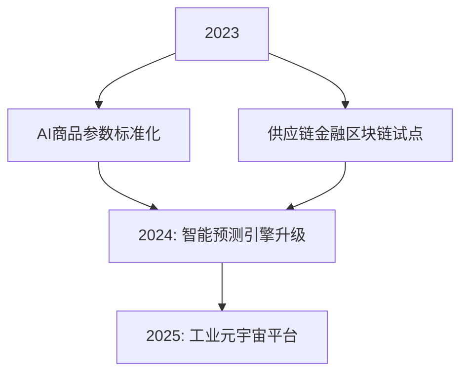
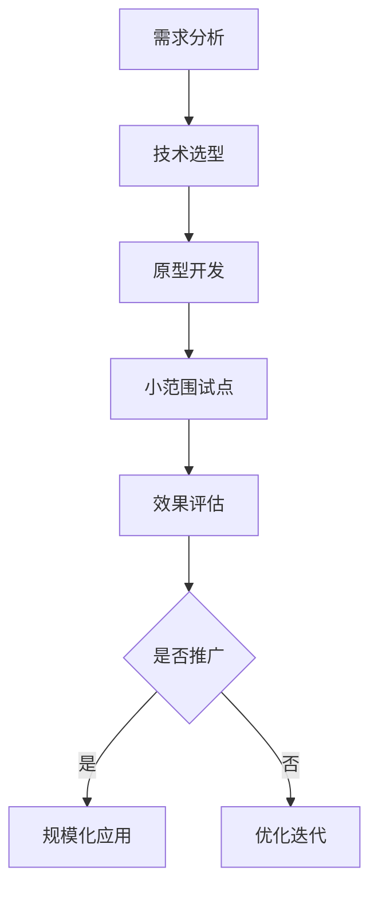

将新技术应用到**工业的业务中需要**战略对齐、场景驱动、敏捷迭代**的系统化方法，结合**工业的业务特性与技术趋势，以下是具体的实施路径与策略：

---

### **一、战略对齐：明确技术应用方向**
#### **1. 业务痛点与技术机会匹配**
| **业务痛点**           | **技术解决方案**              | **预期收益**                  |
|------------------------|-------------------------------|------------------------------|
| 供应链协同效率低        | AI驱动的供需匹配算法           | 采购周期缩短50%               |
| 商品参数非标化          | 大模型（LLM）自动标准化        | 数据治理成本降低30%           |
| 跨境合规风险高          | 区块链+智能合约                | 合规成本减少40%               |
| 库存管理粗放            | IoT+边缘计算实时监控           | 库存周转率提升20%             |

#### **2. 技术路线图设计**

---

### **二、场景驱动：选择高价值应用场景**
#### **1. 智能供应链优化**
- **技术应用**：
    - **AI预测**：基于历史数据与实时需求预测库存
    - **数字孪生**：构建供应链全链路仿真模型
- **案例**：  
  **工业“太璞”平台通过AI预测，将库存周转率提升15%，缺货率降低30%

#### **2. 工业品智能采购**
- **技术应用**：
    - **大模型**：智能生成采购合同与询价单
    - **RPA**：自动化处理供应商对账与开票
- **案例**：  
  某汽车制造商通过智能采购系统，将采购周期从7天缩短至1天

#### **3. 跨境贸易合规**
- **技术应用**：
    - **区块链**：实现跨境交易数据不可篡改
    - **智能合约**：自动执行关税计算与支付
- **案例**：  
  蚂蚁链支持跨境贸易融资，放款时间从7天降至1秒

---

### **三、敏捷迭代：构建技术落地闭环**
#### **1. 技术验证流程**

#### **2. 试点项目设计**
- **选择标准**：
    - 业务价值高（如核心供应链环节）
    - 技术可行性已验证（如AI算法准确率>90%）
    - 风险可控（如试点范围≤10%业务量）
- **案例**：  
  **工业在3个区域试点智能仓储系统，成功后将扩展至全国

---

### **四、组织与文化：构建创新友好环境**
#### **1. 创新激励机制**
- **技术影响力积分**：  
  | **行为**           | **积分** | **兑换奖励**              |
  |--------------------|----------|--------------------------|
  | 提交技术提案        | 10       | 技术书籍/在线课程         |
  | 参与开源贡献        | 20       | 技术大会参会资格          |
  | 主导创新项目        | 50       | 额外年假+管理层午餐       |

#### **2. 技术社区建设**
- **内部技术论坛**：
    - 每月举办“Tech Talk”分享最新技术趋势
    - 设立“极客奖”，表彰技术突破与创新

---

### **五、资源保障：构建技术落地支撑体系**
#### **1. 技术投资预算**
- **分配模型**：  
  | **类型**       | **占比** | **用途**                  |
  |----------------|----------|--------------------------|
  | 战略型技术     | 50%      | AI、区块链核心能力建设    |
  | 赋能型技术     | 30%      | 低代码平台、自动化工具    |
  | 基础型技术     | 15%      | 云原生架构升级            |
  | 探索型技术     | 5%       | 量子计算、脑机接口预研    |

#### **2. 外部合作生态**
- **产学研合作**：
    - 与清华、中科院共建联合实验室
    - 参与工业互联网标准制定
- **技术供应商联盟**：
    - 与AWS、华为云建立战略合作
    - 投资AI初创企业（如第四范式）

---

### **六、**工业实战案例**
#### **案例：AI驱动的供应链预测系统**
- **技术应用**：
    - 使用Transformer模型优化需求预测
    - 集成实时数据流（IoT+边缘计算）
- **实施路径**：
    1. **2023 Q1**：完成算法原型开发，准确率>85%
    2. **2023 Q2**：在5个区域试点，优化模型参数
    3. **2023 Q4**：全国推广，预测准确率提升至95%
- **成果**：
    - 库存周转率提升20%
    - 获评工信部“工业互联网创新案例”

---

### **总结**
将新技术应用到**工业业务的核心在于：
1. **战略聚焦**：选择与供应链、工业品采购强相关的技术方向
2. **场景驱动**：通过试点项目验证技术价值，降低规模化风险
3. **敏捷迭代**：快速试错与优化，确保技术落地效果
4. **生态协同**：构建产学研用一体化创新生态

通过上述方法，**工业可加速技术商业化进程，实现从“技术跟随者”到“行业引领者”的跨越。